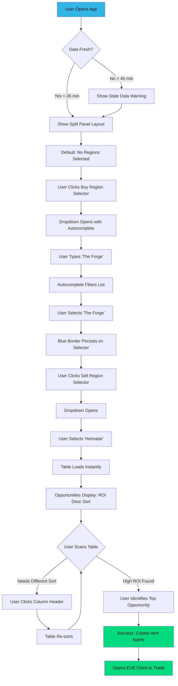
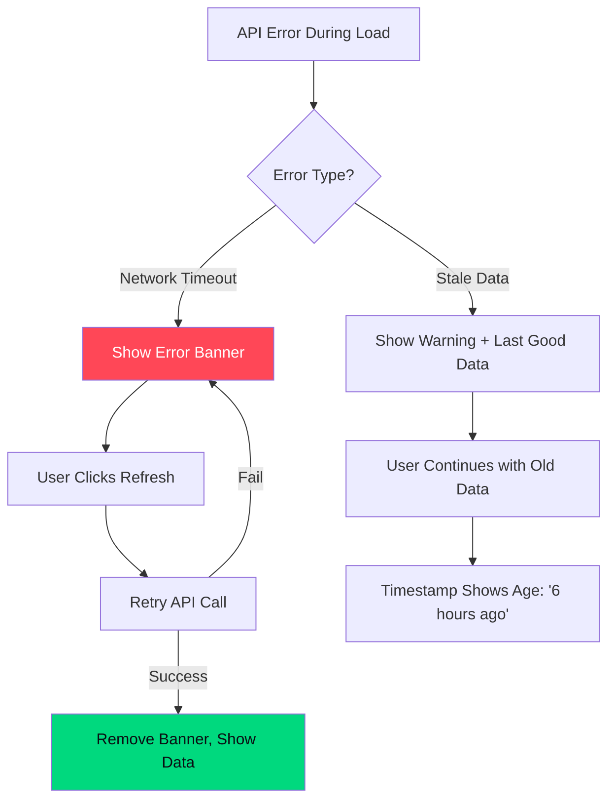
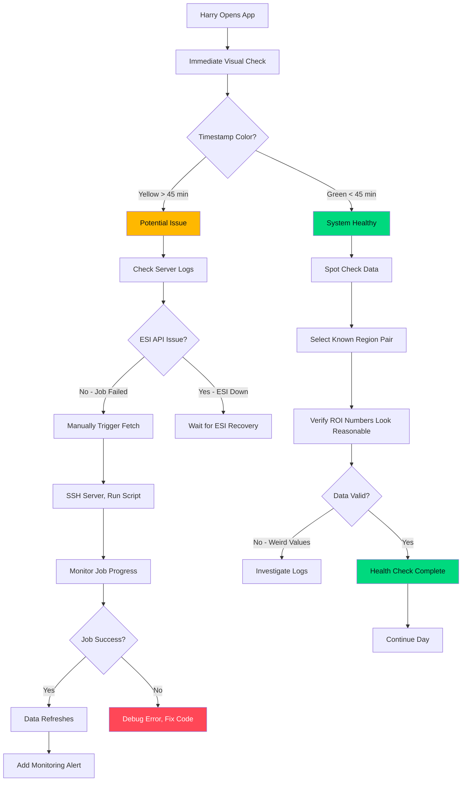
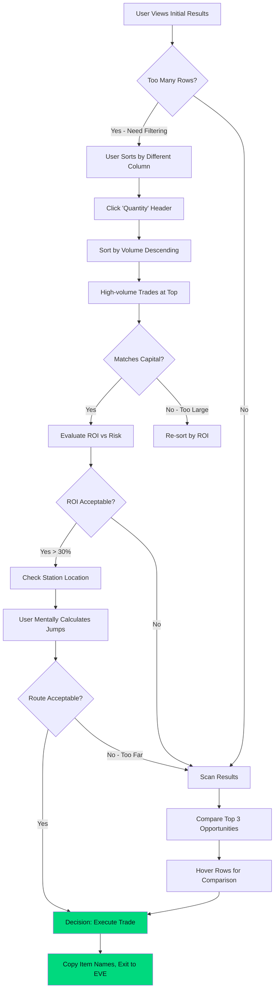

# UX Design Specification eve-market-web-app

**Author:** Harry
**Date:** 2026-02-14

---

## Executive Summary

### Project Vision

EVE Market Web App is a speed-focused trading scanner built for serious EVE Online region traders. The vision is elegantly simple: enable traders to identify ALL profitable cross-region opportunities across 60+ EVE markets in under 10 seconds. This is a personal tool built for Harry and 5-10 trading friends with zero hosting budget, demanding smart architectural choices and ruthless feature prioritization.

**Core Philosophy:** Brutal minimalism – traders should be lost in profit calculations, not UI complexity. Every second spent understanding the interface is a second NOT spent making ISK.

### Target Users

**Primary User: Marcus "The Hauler" Chen**
- EVE Online region trader with billions in ISK to deploy
- Time-constrained (30 minutes between obligations)
- Frustrated by tools that only show obvious routes (Jita → Amarr)
- Seeks hidden opportunities in overlooked regions (The Citadel, Metropolis, etc.)
- Spreadsheet warrior – loves data density, hates hand-holding
- Dual-monitor desktop setup (scanner + EVE client side-by-side)

**Secondary User: Harry (Operator)**
- Developer and maintainer
- Needs reliable operation with minimal maintenance (< 30 min/week)
- Monitors system health, handles recovery scenarios
- Values clean logs and straightforward debugging

**User Savviness:** EVE traders are power users who demand Bloomberg Terminal efficiency, not consumer app chattiness. They want maximum information density with zero cognitive load.

### Key Design Challenges

1. **Data Density vs Clarity**
   - Display potentially 10,000+ trading opportunities without overwhelming users
   - Virtual scrolling + instant client-side sorting are non-negotiable
   - Dense data tables must remain scannable and readable

2. **Trust Through Data Freshness**
   - "Last updated" timestamp is a critical trust indicator, not decoration
   - Stale data leads to bad trades – freshness communication is paramount
   - Must be prominently displayed and immediately visible

3. **Zero Cognitive Load Region Selection**
   - 60+ regions but users shouldn't memorize exact names
   - Fuzzy autocomplete + keyboard navigation required
   - No mouse required for power users

4. **Minimalist Information Architecture**
   - One screen, one purpose – no hidden features or buried menus
   - Everything Marcus needs visible at page load
   - No tabs, no progressive disclosure – pure directness

### Design Opportunities

1. **"Power User First" Design Philosophy**
   - Embrace keyboard shortcuts and dense data presentation
   - Instant response times (< 200ms interactions)
   - Design for experts, not beginners – lean into complexity

2. **Visual Hierarchy Through ROI** (Post-MVP)
   - Subtle color-coding by ROI tiers (high profit opportunities naturally draw the eye)
   - High = green glow, medium = neutral, low = dimmed
   - Visual guide without cluttering the minimalist aesthetic

3. **Effortless Theme Switching**
   - Traders work odd hours across time zones
   - Respect system dark mode preference automatically
   - Single-click toggle for manual override
   - Quality-of-life feature that shows attention to trader's reality

4. **Speed to Profit**
   - Target: 10 seconds from page load to actionable trade identified
   - Muscle memory interaction patterns (same two clicks every time)
   - Immediate visual feedback for all interactions

## Core User Experience

### Defining Experience

The core experience of EVE Market Web App centers on **elimination of friction between intent and insight**. The primary user action is deceptively simple: select a buy market, select a sell market, and instantly see ALL profitable trading opportunities. This two-click interaction must feel like muscle memory – zero cognitive load, maximum information yield.

**The Core Loop:**
1. User selects buy region (autocomplete with keyboard navigation)
2. User selects sell region (autocomplete with keyboard navigation)
3. Table populates instantly (< 500ms) with ALL opportunities
4. User sorts by preferred metric (ROI, quantity, price) with single click
5. User customizes visible columns based on current trading focus
6. User identifies actionable trade in < 10 seconds total

This loop repeats multiple times per session as traders explore different region combinations. Speed and consistency are paramount.

### Platform Strategy

**Primary Platform:** Desktop web application (SPA architecture)

**Technical Approach:**
- Modern web browsers only (Chrome, Firefox, Edge, Safari - latest 2 versions)
- No mobile optimization required for MVP (desktop-first design)
- Client-side rendering with heavy state management
- Virtual scrolling for large dataset performance

**Usage Context:**
- Dual-monitor setup assumption (scanner + EVE client side-by-side)
- Mouse and keyboard interaction patterns (heavy keyboard navigation for power users)
- Extended focus sessions (traders analyze multiple region combinations)
- Time-pressured decision making (30-minute trading windows common)

**Platform Capabilities to Leverage:**
- localStorage for preference persistence (theme, column visibility)
- Modern CSS for instant theme switching (CSS variables)
- Web Workers for background data processing (if needed for large datasets)
- Keyboard event handling for navigation shortcuts

### Effortless Interactions

These interactions must feel completely natural and require zero conscious thought:

**1. Region Selection via Autocomplete**
- Fuzzy search matching (typos don't break the flow)
- Type "for" → "The Forge" appears instantly
- Keyboard navigation (arrow keys, Enter to select, Escape to cancel)
- No mouse required for power users
- Remembers recent selections (future enhancement)

**2. Instant Table Rendering**
- No loading spinners or artificial delays
- < 500ms from region selection to populated table
- Virtual scrolling handles 10,000+ rows without performance degradation
- Smooth scrolling with no jank or lag

**3. One-Click Column Sorting**
- Click column header → instant sort (descending by default for ROI)
- Click again → ascending sort
- Visual indicator shows current sort column and direction
- Pure client-side operation (no server round-trip)
- < 200ms sort execution time regardless of dataset size

**4. Show/Hide Column Customization**
- Quick access toggle UI (checkbox menu or similar)
- Changes apply instantly without table re-render
- Preference persists across sessions (localStorage)
- Default visible columns: Item Name, Buy Price, Sell Price, ROI%, Quantity
- Optional columns: Buy Station, Sell Station, Volume, other metadata

**5. Theme Switching**
- Respects system preference on first visit (prefers-color-scheme)
- Single-click manual toggle (sun/moon icon or similar)
- Instant visual transition (no page reload)
- Preference persisted across sessions

### Critical Success Moments

These are the make-or-break moments where experience quality determines product success:

**1. First Page Load (< 2 seconds)**
- If initial load exceeds 2 seconds, user bounces before seeing value
- First impression sets expectation for all future interactions
- Clean, minimal UI immediately communicates purpose

**2. Region Selection Responsiveness**
- Autocomplete must respond in < 100ms
- Laggy or requiring exact spelling kills power user flow
- Keyboard navigation must be butter-smooth

**3. Table Population Speed**
- Loading spinner should be barely perceptible (< 200ms)
- Extended waits (> 500ms) erode trust in "instant" value proposition
- Empty states must clearly communicate data availability

**4. First Column Sort**
- If sorting feels sluggish, the "power tool" illusion breaks
- Traders will sort multiple times per session – must be instant
- Visual feedback must be immediate (active column indicator)

**5. Data Freshness Verification**
- "Last updated" timestamp must be immediately visible on page load
- Stale data (> 45 minutes) must be clearly communicated
- Traders trusting bad data make losing trades – timestamp is critical trust signal

**The "Aha!" Moment:**
Marcus selects "The Forge" and "Heimatar", table populates instantly, he clicks the ROI column header, table re-sorts in a blink, and within 8 seconds he's spotted a 43% opportunity on Compressed Veldspar. He thinks: "This is exactly what I needed – no BS, just profit opportunities."

### Experience Principles

These principles guide all UX decisions for EVE Market Web App:

**1. Speed Is a Feature, Not a Bonus**
Every interaction must feel instantaneous. Sub-200ms response times aren't "nice to have" – they're the foundation of trust. If it's not fast, it's not working.

**2. Information Density Over Hand-Holding**
Power users want maximum data in minimum space. No tooltips explaining ROI. No onboarding modals. No progressive disclosure. Everything visible, nothing patronizing.

**3. Keyboard-First, Mouse-Second**
Traders using this app are in flow state. Mouse movement is friction. Design for keyboard navigation first, mouse interaction second. Tab, Arrow, Enter, Escape – these are the language of speed.

**4. Trust Through Transparency**
The "Last updated" timestamp isn't decoration – it's a contract. Data freshness must be immediately visible and never ambiguous. Stale data must be impossible to miss.

**5. Customization Without Complexity**
Column visibility customization serves different trading strategies (some care about stations, others only ROI). But accessing this customization must be obvious and changes must be instant. Power without penalty.

**6. Brutal Minimalism**
One screen. One purpose. Zero navigation chrome. Marcus should be swimming in profit calculations, not drowning in UI complexity. Every pixel that doesn't serve data display or core interaction is waste.

## Desired Emotional Response

### Primary Emotional Goals

EVE Market Web App is designed to evoke four core emotional responses in users:

**1. Empowerment**
Users should feel powerful and informed – they have access to comprehensive market intelligence across ALL 60+ EVE regions that most traders don't analyze. This isn't just data; it's competitive advantage.

**2. Efficiency**
Every interaction should reinforce the feeling "I'm not wasting time." Marcus should feel like he's making optimal trading decisions in minimal time. Speed isn't just functional – it's emotionally validating.

**3. Confidence**
Users must feel certain about the data they're seeing. Fresh timestamps, clear sorting indicators, and transparent system status create confidence. Uncertainty kills trading decisions.

**4. Control**
Power users demand agency. Customizable columns, client-side sorting, keyboard navigation – these aren't features, they're respect for user autonomy. Marcus should feel: "This tool bends to my workflow, not the other way around."

### Emotional Journey Mapping

**First Discovery (0-30 seconds)**
- **Target Emotion:** "Finally, a tool that doesn't waste my time"
- **Design Support:** No onboarding modals, immediate clarity of purpose, clean minimal interface
- **Success Metric:** User understands what to do without reading instructions

**During Core Experience (30 seconds - 5 minutes)**
- **Target Emotion:** "Flow state" – scanning data, sorting, analyzing without conscious thought
- **Design Support:** Sub-200ms interactions, keyboard navigation, zero UI friction
- **Success Metric:** User loses awareness of interface, focuses purely on data

**After Finding a Trade (5-10 seconds)**
- **Target Emotion:** "Satisfaction + excitement" – "43% ROI I wouldn't have found manually"
- **Design Support:** Sorted data highlights best opportunities, clear numerical display
- **Success Metric:** User immediately switches to EVE client to execute trade

**When Returning (repeat usage)**
- **Target Emotion:** "Trust + routine" – This tool is now part of trading workflow
- **Design Support:** Consistent behavior, remembered preferences (theme, columns), reliable data
- **Success Metric:** User bookmarks the app and checks it before every trading session

**If Something Goes Wrong (error states)**
- **Target Emotion:** "Informed, not abandoned" – Clear understanding of what failed
- **Design Support:** Prominent "Last updated" timestamp, clear error messages, visible system status
- **Success Metric:** User knows whether to wait, refresh, or come back later

### Micro-Emotions

These subtle emotional states compound into the overall user experience:

**Confidence vs. Confusion**
- **Target:** Maximum confidence at every interaction
- **Design Approach:** Clear data labels, obvious controls, immediate visual feedback
- **Anti-Pattern:** Hidden features, unclear states, ambiguous data

**Trust vs. Skepticism**
- **Target:** Absolute trust in data accuracy and freshness
- **Design Approach:** Prominent timestamp, transparent error communication, consistent data quality
- **Anti-Pattern:** Hidden staleness, unclear data age, misleading numbers

**Efficiency vs. Frustration**
- **Target:** Every interaction reinforces "this is fast"
- **Design Approach:** Sub-200ms response times, instant client-side operations, no artificial delays
- **Anti-Pattern:** Loading spinners, server round-trips for client-side operations, sluggish sorting

**Accomplishment vs. Satisfaction**
- **Target:** Finding high-ROI trades feels like accomplishment (discovery), using the tool feels satisfying (smooth)
- **Design Approach:** Data density reveals hidden opportunities, instant sorting enables quick comparisons
- **Anti-Pattern:** Pagination hiding opportunities, slow sorting preventing comparison flow

**Focus vs. Distraction**
- **Target:** Brutal minimalism maintains focus on profit calculations
- **Design Approach:** One screen, dense data tables, minimal decoration, purposeful color use only
- **Anti-Pattern:** Unnecessary animations, tutorial tooltips, navigation chrome, visual clutter

### Design Implications

These emotional goals directly inform specific UX design decisions:

**Empowerment Emotion Drives:**
- Column customization UI (user controls visible data)
- No artificial pagination limits (show ALL opportunities)
- Client-side sorting (user controls data view instantly)
- Keyboard shortcuts (power user control)

**Efficiency Emotion Drives:**
- Sub-200ms interaction performance targets
- Keyboard-first navigation design
- Zero loading states between user interactions
- Autocomplete with fuzzy matching (typos don't slow flow)

**Confidence Emotion Drives:**
- Prominent "Last updated" timestamp (always visible)
- Clear visual feedback on all interactions (active sort column, selected regions)
- No ambiguous UI states (loading, empty, error all clearly communicated)
- Consistent sorting behavior (descending ROI by default)

**Trust Emotion Drives:**
- Data freshness transparency (never hide last update time)
- Stale data warning when age exceeds 45 minutes
- Clear error messages with recovery guidance
- Reliable system behavior across sessions

**Control Emotion Drives:**
- Customizable column visibility with instant application
- User-selectable theme (light/dark) with preference persistence
- Manual sort control (click any column header)
- Keyboard navigation option (no forced mouse usage)

**Focus Emotion Drives:**
- Single-screen architecture (no tabs, no hidden sections)
- Dense data tables without decorative elements
- Minimal color usage (avoid visual distraction)
- No tutorial modals or onboarding flows

### Emotional Design Principles

**1. Speed Creates Trust**
When interactions respond in < 200ms, users unconsciously trust the system. Lag creates doubt. Speed isn't just functional – it's emotional reassurance that the tool is reliable.

**2. Transparency Defeats Anxiety**
The "Last updated" timestamp eliminates user anxiety about data quality. What's visible can be trusted; what's hidden creates skepticism. Always show system state.

**3. Control Equals Respect**
Giving Marcus column customization and keyboard navigation says "we respect your expertise." Power users feel patronized by hand-holding; they feel respected by customization.

**4. Minimalism Enables Focus**
Every pixel that doesn't serve data or core interaction is emotional overhead. Decoration demands attention. Minimalism redirects that attention to profit calculations.

**5. Consistency Builds Routine**
Muscle memory requires predictable behavior. Same two-click flow every session. Same keyboard shortcuts. Same column order. Consistency transforms conscious decisions into automatic routine.

**6. Failure Transparency Maintains Trust**
When data fetch fails, hiding it destroys trust. Showing "Last updated: 6 hours ago" preserves trust even in failure. Users forgive transparent failures; they abandon opaque ones.

## UX Pattern Analysis & Inspiration

### Inspiring Products Analysis

**Core Design Philosophy: Radical Simplicity**

Rather than borrowing patterns from multiple products, EVE Market Web App embraces a singular design principle: **brutal minimalism**. The inspiration comes not from adding features other tools have, but from ruthlessly removing everything that doesn't serve the core two-click workflow.

**Anti-Inspiration Approach:**
Many market tools fail by trying to be comprehensive feature suites. They add tabs, dashboards, filters, and customization that creates cognitive overhead. Marcus doesn't need another complex tool – he needs one that gets out of his way.

**Design Reference Point:**
Think Bloomberg Terminal efficiency (dense data, keyboard-first, zero decoration) but with modern web performance and single-purpose focus. Not copying Bloomberg's complexity – learning from its data density and professional aesthetic.

### Transferable UX Patterns

**Data Table Excellence:**
- Sortable column headers (universal pattern, well-understood by power users)
- Virtual scrolling for large datasets (proven performance pattern)
- Fixed table header during scroll (maintains context)

**Autocomplete with Keyboard Navigation:**
- Fuzzy matching (reduces cognitive load for selection)
- Arrow key navigation (standard pattern, requires no learning)
- Escape to cancel (universal interaction language)

**Theme Switching:**
- System preference detection (respects user's OS choice)
- Manual toggle with persistent preference (user autonomy)
- CSS variable-based implementation (instant switching)

### Anti-Patterns to Avoid

**Feature Creep:**
- No dashboard with multiple widgets – single table view only
- No "advanced" vs "simple" modes – one mode that works
- No feature discovery tours or tooltips – interface explains itself

**Performance Theater:**
- No progress bars for sub-second operations – they create anxiety
- No skeleton screens – instant data or clear "loading" state
- No artificial delays to make operations "feel" substantial

**False Customization:**
- No theme builder or color pickers – light/dark is sufficient
- No complex filter UI – sorting serves 90% of use cases
- No dashboard rearrangement or layout options – fixed optimal layout

**Navigation Complexity:**
- No sidebar navigation – nowhere else to navigate to
- No breadcrumbs – there's only one screen
- No tabs – everything visible at once

### Design Inspiration Strategy

**What to Adopt:**
- **Data density without clutter** – maximize information per pixel
- **Keyboard-first interaction** – standard patterns (Tab, Enter, Arrow, Escape)
- **Instant feedback** – sub-200ms response creates trust

**What to Create Fresh:**
- **Single-screen market comparison** – most tools use multi-step workflows
- **ALL opportunities visible** – competitors paginate or limit results
- **Zero configuration required** – works perfectly on first load

**What to Reject:**
- **Feature parity thinking** – "competitors have filters, so we need filters"
- **Onboarding flows** – tooltips, tours, walkthroughs add friction
- **Customization theater** – options that don't serve real use cases

**Guiding Principle:**
Before adding any UI element, ask: "Does this serve the 10-second profit discovery goal?" If no, it doesn't belong in MVP.

## Design System Foundation

### Design System Choice

**Selected Approach: Headless UI + Tailwind CSS**

A lightweight, behavior-focused component library (Headless UI or Radix UI) combined with Tailwind CSS utility-first styling. This approach provides polished, accessible components with complete visual control.

**Core Stack:**
- **Headless UI / Radix UI:** Provides accessible, keyboard-navigable components (autocomplete, dropdowns) without visual opinions
- **Tailwind CSS:** Utility-first CSS framework for rapid, consistent styling with minimal production bundle
- **CSS Variables:** Theme switching (light/dark) via custom properties
- **Virtual Scrolling Library:** React Virtual or similar for table performance with large datasets

### Rationale for Selection

**1. Modern Polish Without Bloat**
Headless UI components deliver professional behavior (accessibility, keyboard navigation, focus management) without imposing visual design. Combined with Tailwind, this creates a modern aesthetic that feels polished but lightweight.

**2. Speed for Solo Developer**
Tailwind's utility classes enable rapid styling iteration without context switching between HTML and CSS files. Headless UI solves complex interaction patterns (autocomplete dropdown with keyboard nav) without building from scratch.

**3. Perfect for Brutal Minimalism**
Unlike Material Design or Bootstrap, this stack adds zero visual opinions. Every pixel is intentional, not inherited. The autocomplete, table, and theme toggle get polished behavior while maintaining minimalist aesthetic.

**4. Performance Optimized**
- Tailwind purges unused CSS (production bundle typically < 10KB)
- Headless UI has minimal JavaScript footprint
- No unused components shipping to users
- Aligns with free hosting performance requirements

**5. Keyboard-First by Default**
Headless UI components include keyboard navigation out of the box. Arrow keys, Enter, Escape, Tab – all work correctly without manual implementation. This serves power users perfectly.

**6. Maintainability**
- Well-documented libraries with active communities
- Predictable behavior patterns (standard React/Vue patterns)
- Easy debugging (utility classes show exactly what's styled)
- Low dependency count reduces maintenance burden

### Implementation Approach

**Phase 1: Foundation Setup**
1. Install Tailwind CSS with PostCSS configuration
2. Define color palette (light/dark themes) via Tailwind config
3. Set up CSS variables for theme switching
4. Configure Tailwind purge for production optimization

**Phase 2: Core Components**
1. **Region Autocomplete:** Headless UI Combobox component with Tailwind styling
2. **Data Table:** Custom table component with Tailwind styling + virtual scrolling library
3. **Theme Toggle:** Headless UI Switch or custom toggle with CSS variable switching
4. **Column Visibility Menu:** Headless UI Menu component with checkboxes

**Phase 3: Polish**
1. Define consistent spacing scale (Tailwind defaults work well)
2. Typography scale (limited to 2-3 sizes for minimalism)
3. Focus states for keyboard navigation
4. Loading and error states

### Customization Strategy

**Typography:**
- System font stack for zero latency (native OS fonts)
- 2-3 font sizes maximum (header, body, table data)
- Monospace for numerical data (ROI percentages, prices)

**Color Palette:**
- **Light Theme:** Neutral grays, minimal color (blue accent for interactive elements)
- **Dark Theme:** True dark background (not gray), muted text colors
- **ROI Color Coding (Post-MVP):** Subtle green for high ROI, neutral for medium/low
- **Status Colors:** Red for errors/stale data, green for success/fresh data

**Spacing:**
- Tailwind's default spacing scale (4px base unit)
- Generous padding in table cells for readability
- Minimal spacing around page edge (maximize data density)

**Interactive Elements:**
- Clear focus indicators (thick outline for keyboard navigation)
- Hover states subtle (slight background color change)
- Active/selected states obvious (visual feedback within 16ms)

**Component Customization:**
- Autocomplete dropdown: max-height with scroll, highlighting matched characters
- Table headers: sticky position, clear sort indicators (arrows)
- Theme toggle: sun/moon icon, positioned top-right corner
- Column menu: checkbox list, positioned near table header

**What NOT to Customize:**
- No custom animations (instant state changes only)
- No gradient backgrounds or decorative elements
- No custom scrollbars (use native OS scrollbars)
- No elaborate loading states (simple text or instant data)

## Defining Core Experience

### The Defining Experience

**"Pick two regions → Instantly see ALL profitable trades"**

This is the signature interaction that defines EVE Market Web App. When Marcus describes this tool to his corp mates, he'll say: "I just select The Forge and Heimatar, and boom – every profitable item right there, sorted by ROI. Found a 43% trade in 8 seconds."

The defining experience is not about complex features or elaborate workflows. It's about **elimination of friction between intent and insight**. Two clicks, instant results, zero cognitive load.

### User Mental Model

**Current Problem-Solving Approaches:**

Marcus and traders like him currently solve region trading analysis through:

1. **Manual Market Checking** – Opening market windows in EVE client, searching items individually (slow, incomplete coverage)
2. **Spreadsheet Analysis** – Exporting market data, manually calculating ROI in Excel (tedious, data goes stale quickly)
3. **Trade Chat Intelligence** – Asking in Discord/chat for opportunities (unreliable, by the time everyone knows, margins are gone)

**Mental Model Users Bring:**

- "Market scanning should feel like looking at a live spreadsheet"
- "I select WHERE I'm trading (regions), system shows WHAT to trade (items)"
- "Sorting by ROI should be instant, like Excel"
- "Data freshness is critical – stale data leads to bad trades"
- "All data should be visible at once, no hunting through menus"

**Existing Solution Analysis:**

- **What Users Love:** Spreadsheets give total control over data, sorting, and filtering
- **What Users Hate:** Manual data entry, constant staleness, limited to markets they manually check
- **Common Workaround:** Traders share opportunities in Discord channels, but by the time they see it and verify, profit margins have evaporated

**Key Insight:** Users don't want a new interaction model. They want the speed and control of spreadsheets combined with live, comprehensive market coverage across ALL EVE regions.

### Success Criteria

**Marcus feels successful when these conditions are met:**

**1. Speed Victory**
- **User Statement:** "I found a 43% ROI trade in under 10 seconds"
- **Technical Requirements:**
  - Table populates in < 500ms from region selection
  - Sorting executes in < 200ms regardless of dataset size
  - No loading spinners for sub-second operations
  - Instant visual feedback on all interactions

**2. Data Trust**
- **User Statement:** "This data is fresh, I can act on it immediately"
- **Technical Requirements:**
  - "Last updated" timestamp displayed prominently on page load
  - Data age clearly communicated (< 45 minutes = fresh, > 45 minutes = stale warning)
  - No ambiguity about data reliability
  - Transparent communication if background job fails

**3. Completeness Confidence**
- **User Statement:** "I'm seeing EVERYTHING, not missing hidden opportunities"
- **Technical Requirements:**
  - ALL profitable opportunities visible (no pagination hiding results)
  - Virtual scrolling handles 10,000+ rows smoothly
  - Sortable by any column to explore from different perspectives
  - No artificial result limits or truncation

**4. Control Mastery**
- **User Statement:** "This tool bends to my workflow, not the other way around"
- **Technical Requirements:**
  - Column visibility customization (show only what matters for current strategy)
  - Keyboard navigation throughout (no forced mouse usage)
  - Preferences persist across sessions (theme, columns)
  - Customization without complexity (changes apply instantly)

**5. Zero Cognitive Load**
- **User Statement:** "I don't think about the UI, I think about profit"
- **Technical Requirements:**
  - Autocomplete handles typos and partial region names
  - Sort direction visually obvious (arrow indicators)
  - Interface disappears, data takes center stage
  - No tutorials, tooltips, or onboarding required

### Novel vs. Established Patterns

**This Application Uses ESTABLISHED Patterns Exclusively**

The UX strategy intentionally avoids novel interaction patterns. Power users like Marcus bring strong mental models from existing tools:

**Established Patterns Adopted:**

1. **Sortable Data Tables**
   - Universal pattern understood by any Excel user
   - Click header to sort, click again to reverse
   - Visual indicators (arrows) show sort column and direction
   - No learning curve required

2. **Autocomplete Dropdowns**
   - Standard search pattern familiar from Google, IDE code completion
   - Keyboard navigation (arrow keys, Enter, Escape) follows OS conventions
   - Fuzzy matching reduces friction from typos
   - Instant visual feedback on selection

3. **Column Show/Hide**
   - Familiar from spreadsheets, data analysis tools, BI dashboards
   - Checkbox menu pattern (standard in Figma, Excel, data tools)
   - Changes apply instantly without confirmation dialogs

4. **Light/Dark Theme Toggle**
   - Modern convention across developer tools and productivity apps
   - System preference detection (respects OS choice)
   - Manual override with persistent preference

**Why No Novel Patterns:**

Novel interaction patterns require user education and create cognitive load. Marcus has 30 minutes before fleet ops – he doesn't have time to learn a new interaction model.

**Where We Innovate:**

Innovation is not in HOW users interact (established patterns are superior), but in WHAT we show them:
- **Comprehensive coverage** across ALL 60+ EVE regions (competitors focus on major hubs)
- **Zero pagination** showing complete opportunity landscape
- **Instant performance** with datasets competitors can't handle efficiently

The UX innovation is through **elimination and performance**, not addition of novel patterns.

### Experience Mechanics

**Detailed Step-by-Step Interaction Flow:**

**1. Initiation (Page Load - 0 seconds)**
- User lands on page → clean single-screen interface loads
- Two dropdown selectors immediately visible: "Buy Market" and "Sell Market"
- Default state: No regions selected, placeholder text guides action
- "Last updated" timestamp visible in footer (establishes data trust immediately)
- Theme respects system preference (light/dark detected automatically)

**2. Region Selection - Buy Market (0-3 seconds)**
- User clicks "Buy Market" dropdown OR tabs to it (keyboard focus)
- Dropdown opens with all 60+ EVE regions listed
- Search input automatically focused (user can start typing immediately)
- User types "for" → fuzzy matching highlights "The **For**ge"
- Arrow down key → highlight moves to next match
- Enter key → selection confirmed, dropdown closes
- "The Forge" now displayed in selector with clear visual confirmation

**3. Region Selection - Sell Market (3-6 seconds)**
- Focus automatically advances to "Sell Market" dropdown (OR user tabs)
- Same autocomplete behavior as buy market selection
- User types "heim" → fuzzy match shows "**Heim**atar"
- Enter → selection confirmed, dropdown closes
- Both regions now visibly selected

**4. Data Load & Display (6-7 seconds)**
- API call fires instantly (< 100ms to initiate request)
- Table populates with ALL profitable opportunities (< 500ms total time)
- Default sort: ROI% descending (highest profit opportunities at top)
- Virtual scrolling enables smooth performance with 10,000+ rows
- No loading spinner (too fast to show), just instant population
- Empty state if no opportunities: "No profitable trades found between The Forge and Heimatar"

**5. Interaction - Sorting (7-8 seconds)**
- User clicks "ROI %" column header
- Sort indicator immediately appears (down arrow = descending)
- Table re-sorts instantly (< 200ms)
- Click again → sort reverses to ascending (up arrow indicator)
- Keyboard alternative: Tab to column header, Enter to sort

**6. Interaction - Column Customization (Optional)**
- User clicks column visibility icon/button (positioned near table header)
- Checkbox menu drops down showing all available columns
- User unchecks "Buy Station" and "Sell Station" (only cares about ROI and quantity)
- Table instantly updates, removing unchecked columns
- Preference saved to localStorage (persists on next visit)
- Menu closes via click outside or Escape key

**7. Completion & Success (8-10 seconds)**
- User scans top 5-10 ROI opportunities in sorted table
- Identifies actionable trade: "Compressed Veldspar, 43% ROI, 1.2M units available"
- Visual scan complete, decision made
- User switches to EVE client to execute trade
- **Success Moment:** Found profitable trade in < 10 seconds from page load

**8. Error Handling & Edge Cases**

**Stale Data Warning:**
- If data age > 45 minutes: Yellow warning banner appears at top
- Message: "Data may be stale (Last updated: 6 hours ago). Verify prices in-game before trading."
- User can proceed with caution or wait for next background update

**API Failure:**
- If API call fails: Clear error message replaces table
- Message: "Unable to load opportunities. Last successful update: [timestamp]. Try refreshing in a few minutes."
- No technical jargon, clear recovery guidance

**No Opportunities Found:**
- If selected regions have zero profitable trades: Empty state appears
- Message: "No profitable trades found between [Region A] and [Region B] with current market conditions."
- Suggests trying different region combinations

**Keyboard Navigation Throughout:**
- Tab: Move between controls (buy market, sell market, table, column menu, theme toggle)
- Enter: Activate/confirm selections
- Escape: Close dropdowns/menus, clear focus
- Arrow keys: Navigate autocomplete options, move through table rows
- Space: Toggle checkboxes in column visibility menu

## Visual Design Foundation

### Color System

**Design Inspiration: EVE Online Aesthetic**

The visual foundation draws inspiration from EVE Online's signature dark sci-fi aesthetic – deep space blacks, iconic cyan-blue accents, and clean geometric interfaces that feel like advanced trading terminals. This creates familiarity for EVE traders while maintaining professional, readable design.

**Dark Theme (Primary - Default)**

*Background Layers:*
- **Deep Space:** `#0A0E12` - Main background (space black)
- **Panel Dark:** `#151921` - Elevated surfaces, table rows
- **Panel Medium:** `#1E252E` - Cards, dropdowns, overlays
- **Border/Divider:** `#2A3441` - Subtle separation lines

*EVE Blue Accent (Signature Color):*
- **Primary Blue:** `#33B5E5` - EVE signature cyan-blue for interactive elements
- **Blue Hover:** `#52C7F2` - Lighter variation on hover state
- **Blue Active:** `#1E9FCC` - Darker variation on pressed/active state
- **Blue Glow:** `#33B5E5` with 8px blur - Subtle glow on focus states

*Text Colors:*
- **High Emphasis:** `#E8ECEF` - Primary text, headers, important data
- **Medium Emphasis:** `#B0B8C1` - Body text, labels, descriptions
- **Low Emphasis:** `#6B7785` - Hint text, timestamps, secondary info

*Status Colors:*
- **Success/Fresh:** `#00D97E` - Green for high ROI, fresh data indicators
- **Warning/Stale:** `#FFB800` - Yellow/gold for stale data warnings
- **Error/Critical:** `#FF4757` - Red for errors, failures
- **ROI Highlight:** `#00FFA3` - Bright cyan-green for exceptional ROI (Post-MVP color coding)

*Numerical Data:*
- **Profit Green:** `#00D97E` - Positive values, profits
- **Loss Red:** `#FF4757` - Negative values, losses
- **Neutral:** `#B0B8C1` - Standard numerical display

**Light Theme (Secondary - Daytime Use)**

*Background Layers:*
- **Clean White:** `#FFFFFF` - Main background
- **Panel Light:** `#F5F7FA` - Elevated surfaces, table rows
- **Panel Medium:** `#E8ECEF` - Cards, dropdowns, overlays
- **Border/Divider:** `#D1D7DD` - Subtle separation lines

*EVE Blue Accent:* (Same as dark theme)
- **Primary Blue:** `#33B5E5`
- **Blue Hover:** `#52C7F2`
- **Blue Active:** `#1E9FCC`

*Text Colors:*
- **High Emphasis:** `#1A1D23` - Primary text, headers
- **Medium Emphasis:** `#4A5568` - Body text, labels
- **Low Emphasis:** `#8792A2` - Hint text, timestamps

*Status Colors:* (Same intensity as dark theme for consistency)

**Color Usage Principles:**

1. **Purpose-Driven Color**
   - Blue accent only on interactive elements (buttons, links, focus states)
   - Status colors have semantic meaning (green = good, yellow = caution, red = error)
   - Avoid decorative color – every color communicates information

2. **High Contrast for Readability**
   - All text meets WCAG AA standards minimum (4.5:1 contrast ratio)
   - Critical data (ROI, prices) uses high emphasis text for maximum readability
   - Borders subtle but visible for clear UI structure

3. **Minimal Color Palette**
   - Limited to 3 accent colors (blue, green, yellow/red)
   - Backgrounds use neutral grayscale progression
   - Color scarcity increases impact when used purposefully

### Typography System

**Font Families:**

*Sans-Serif (UI Text):*
```css
font-family: 'Inter', -apple-system, BlinkMacSystemFont, 'Segoe UI', sans-serif;
```
- Modern, highly readable typeface optimized for screens
- Excellent legibility at small sizes (critical for dense table data)
- Free and open-source, self-hostable
- Supports wide range of weights for hierarchy

*Monospace (Numerical Data):*
```css
font-family: 'JetBrains Mono', 'Fira Code', 'SF Mono', Consolas, monospace;
```
- Technical/scanner aesthetic (fits EVE trading terminal vibe)
- **Used exclusively for:** ROI percentages, prices, quantities, volumes
- Aligns numbers perfectly in columns for easy scanning
- Maintains readability at small sizes

**Type Scale (Base 100%):**

- **Page Title:** 24px (1.5rem) - font-semibold - High emphasis color
- **Section Heading:** 18px (1.125rem) - font-medium - High emphasis color
- **Body Text:** 14px (0.875rem) - font-normal - Medium emphasis color
- **Table Data:** 13px (0.8125rem) - font-normal - Medium emphasis (monospace for numbers)
- **Small Text:** 12px (0.75rem) - font-normal - Low emphasis (timestamps, hints)
- **Tiny Text:** 11px (0.6875rem) - font-normal - Low emphasis (optional labels)

**Line Heights:**
- **Headers:** 1.2 (tight, impactful, minimal vertical space)
- **Body/UI Text:** 1.5 (balanced readability, comfortable)
- **Table Data:** 1.4 (compact without cramping, scannable)

**Font Weights:**
- **Semibold (600):** Page title, column headers
- **Medium (500):** Section headings, emphasized labels
- **Normal (400):** All body text, table data, standard UI
- **Light (300):** Not used (reduces contrast unnecessarily)

**Typography Usage:**
- Region selector labels: Body text, medium emphasis
- Dropdown items: Body text, high emphasis on selection
- Table headers: Table data size, font-semibold, high emphasis
- Table cells (text): Table data size, medium emphasis
- Table cells (numbers): Table data size, monospace, high emphasis
- Timestamp: Small text, low emphasis (success/warning color when stale)
- Error messages: Body text, high emphasis

### Spacing & Layout Foundation

**Base Spacing Unit: 4px** (Tailwind default system)

**Spacing Scale:**
```
xs:  4px  (0.25rem) - Icon spacing, tight element gaps
sm:  8px  (0.5rem)  - Table cell padding (vertical), compact spacing
md:  12px (0.75rem) - Component spacing, comfortable gaps
lg:  16px (1rem)    - Table cell padding (horizontal), section padding
xl:  24px (1.5rem)  - Major component spacing
2xl: 32px (2rem)    - Section breaks, page structure
3xl: 48px (3rem)    - Rare, major page divisions only
```

**Layout Structure:**

*Page Layout:*
- **Page margins:** 16px on all sides (minimal, maximizes data space)
- **Max width:** 100vw (apps fills viewport, no arbitrary constraints)
- **Min width:** 1280px (defined in PRD - no mobile support)

*Component Spacing:*
- **Region selectors:** 24px horizontal gap between buy/sell dropdowns
- **Selectors to table:** 32px vertical gap
- **Table to footer:** 24px vertical gap
- **Footer padding:** 12px vertical, 16px horizontal

*Table Layout:*
- **Row height:** 40px (comfortable click target, scannable density)
- **Cell padding:** 8px vertical, 16px horizontal
- **Header height:** 44px (slightly taller for visual hierarchy)
- **Header padding:** 10px vertical, 16px horizontal
- **Column gap:** 0 (borders separate columns)
- **Alternating row backgrounds:** For scannability

*Component Padding:*
- **Dropdowns:** 12px all sides
- **Dropdown items:** 8px vertical, 12px horizontal
- **Buttons:** 8px vertical, 16px horizontal
- **Modals/Overlays:** 24px all sides

**Layout Principles:**

1. **Maximum Data Density**
   - Minimal page margins (16px max edges)
   - Table fills all available width and height
   - No wasted vertical space with excessive gaps
   - Content-first layout (no decorative spacing)

2. **Clear Visual Hierarchy Through Spacing**
   - Larger gaps (32px) create major sections
   - Medium gaps (24px) separate related components
   - Small gaps (12px) group related elements
   - Consistent spacing creates predictable rhythm

3. **Scannable Table Design**
   - Fixed header (sticky during scroll)
   - Alternating row backgrounds (visual guides for horizontal scanning)
   - Generous horizontal cell padding (prevents column cramping)
   - Compact vertical padding (maximizes visible rows)

4. **Responsive Behavior**
   - Desktop-first (no mobile breakpoints for MVP)
   - Min width: 1280px enforced
   - Table columns scale proportionally to content
   - Virtual scrolling maintains performance at any viewport height

### Accessibility Considerations

**WCAG Compliance Target: AA**

**Color Contrast Ratios:**

*Dark Theme:*
- High emphasis text on Deep Space: `#E8ECEF` on `#0A0E12` = **14.2:1** (AAA ✓)
- Medium emphasis text on Deep Space: `#B0B8C1` on `#0A0E12` = **9.1:1** (AAA ✓)
- Blue accent on Deep Space: `#33B5E5` on `#0A0E12` = **8.1:1** (AA ✓)
- Success green on Deep Space: `#00D97E` on `#0A0E12` = **7.8:1** (AA ✓)

*Light Theme:*
- High emphasis text on Clean White: `#1A1D23` on `#FFFFFF` = **15.8:1** (AAA ✓)
- Medium emphasis text on Clean White: `#4A5568` on `#FFFFFF` = **8.9:1** (AAA ✓)
- Blue accent on Clean White: `#33B5E5` on `#FFFFFF` = **3.2:1** (Fails AA - used only with text labels)

**Keyboard Focus States:**
- **Focus ring:** 2px solid `#33B5E5` outline
- **Offset:** 2px from element (clear visibility)
- **Applied to:** All interactive elements (buttons, links, inputs, table rows, checkboxes)
- **Visible only on keyboard focus** (not mouse click)

**Screen Reader Support:**
- Semantic HTML (proper heading hierarchy, table markup)
- ARIA labels for icon-only buttons (theme toggle, column visibility)
- ARIA live regions for status updates (data freshness warnings)
- ARIA sort indicators on table headers
- Focus management for dropdown and modal interactions

**Motion & Animation:**
- **No animations** (instant state changes align with minimalism)
- **Respects prefers-reduced-motion** media query
- Transitions limited to color/opacity changes only (< 150ms)

**Font Scaling Feature (Accessibility Enhancement):**

**User Control Over Text Size:**

Provides users with dynamic font size adjustment without browser zoom (which breaks layout).

*Scale Options:*
- **75% (Compact):** For large monitors, maximum data density
- **100% (Default):** Optimized base sizing
- **125% (Comfortable):** Larger text for readability preference
- **150% (Accessibility):** Enhanced size for visual impairments

*Implementation:*
```css
:root {
  --font-scale: 1; /* Default 100% */
}

:root[data-font-scale="75"] { --font-scale: 0.75; }
:root[data-font-scale="125"] { --font-scale: 1.25; }
:root[data-font-scale="150"] { --font-scale: 1.5; }

/* All font sizes multiply by scale variable */
.text-base {
  font-size: calc(14px * var(--font-scale));
}
```

*Scaled Typography Examples:*

**75% Scale (Compact View):**
- Page Title: 18px
- Table Data: 10px
- Small Text: 9px
- Row Height: 30px

**100% Scale (Default):**
- Page Title: 24px
- Table Data: 13px
- Small Text: 12px
- Row Height: 40px

**125% Scale (Comfortable):**
- Page Title: 30px
- Table Data: 16px
- Small Text: 15px
- Row Height: 50px

**150% Scale (Accessibility):**
- Page Title: 36px
- Table Data: 20px
- Small Text: 18px
- Row Height: 60px

*Layout Adaptation:*
- Table row height scales proportionally with font size
- Cell padding scales to maintain visual balance
- Virtual scrolling recalculates visible rows automatically
- Page layout remains fluid (no fixed heights break)
- Monospace number alignment maintained at all scales

*UI Control:*
- **Position:** Near theme toggle (top-right corner)
- **Icon:** Text size indicator ("Aa" with +/- or percentage display)
- **Interaction:** Click opens dropdown with 4 preset options
- **Visual feedback:** Shows current scale percentage ("100%")
- **Persistence:** Preference saved to localStorage

*Benefits:*
- Power users maximize data density on ultrawide monitors (75%)
- Accessibility for users with vision impairments (150%)
- Personal preference without fighting browser zoom
- Maintains table column alignment at any scale

**Color Not Sole Indicator:**
- Sort direction uses arrow icons (not just color change)
- Error states combine icon + text + color
- Data freshness uses text label + timestamp + color
- ROI color coding is enhancement only (post-MVP), not required for comprehension

### Visual Design Principles

**1. EVE-Inspired Sci-Fi Aesthetic**

Capture the feeling of advanced trading terminals in the EVE universe:
- Dark theme as default (matches EVE client aesthetic, reduces eye strain)
- Blue glow accents (signature EVE color language)
- Sharp geometric edges (no border-radius on primary UI elements)
- Subtle transparency on overlays (dropdown menus, modals feel layered)
- Technical/utilitarian design (function over decoration)

**2. Functional Minimalism**

Every visual element must earn its presence:
- No decorative gradients, textures, or patterns
- Color used purposefully (accents draw attention to interactive elements only)
- Borders minimal (separation achieved through background color shifts)
- Shadows subtle (4px blur, low opacity for depth cues only)
- White space intentional (not excessive)

**3. Data-First Visual Hierarchy**

Design prioritizes data visibility:
- Highest contrast reserved for numerical data (ROI, prices, quantities)
- Region selectors prominent but don't visually compete with table
- Theme/font size toggles accessible but unobtrusive
- "Last updated" timestamp visible but not distracting
- Table dominates the viewport (80%+ of screen space)

**4. Professional Bloomberg Terminal Aesthetic**

Match power user expectations:
- Dense information presentation (no wasted space)
- Monospace numbers (professional trading terminal feel)
- Clean data tables (clear grid structure)
- Instant updates (no loading theater)
- Dark theme default (extended usage comfort)

**5. Accessibility Without Compromise**

Accessibility enhances design, doesn't constrain it:
- High contrast improves readability for all users
- Keyboard navigation serves power users and accessibility needs
- Font scaling adds user control without visual clutter
- Semantic markup improves maintainability and screen reader support

### Component Visual Specifications

**Region Selector Dropdowns (Autocomplete):**

*Default State:*
- Background: Panel Medium (`#1E252E` dark / `#E8ECEF` light)
- Border: 1px solid Border color (`#2A3441` dark / `#D1D7DD` light)
- Text: Medium emphasis, Body size
- Placeholder: Low emphasis, Body size
- Padding: 12px vertical, 16px horizontal
- Border radius: 4px (subtle, not rounded)

*Focus State:*
- Border: 2px solid Primary Blue (`#33B5E5`)
- Box shadow: `0 0 8px rgba(51, 181, 229, 0.3)` (blue glow)
- Outline: None (border provides focus indicator)

*Dropdown Menu:*
- Background: Panel Medium (same as input)
- Border: 1px solid Primary Blue
- Box shadow: `0 4px 12px rgba(0, 0, 0, 0.3)` (depth)
- Max height: 320px (8 items @ 40px each)
- Overflow: Scroll (if > 8 items)
- Z-index: 50 (above table)

*Dropdown Items:*
- Height: 40px
- Padding: 8px 12px
- Text: High emphasis, Body size
- Background (default): Transparent
- Background (hover): Panel Dark (`#151921` dark / `#F5F7FA` light)
- Background (selected): Primary Blue with 20% opacity
- Matched characters: Primary Blue color, font-medium

**Data Table:**

*Table Structure:*
- Width: 100% (fills container)
- Background: Deep Space (`#0A0E12`)
- Border: 1px solid Border color (full table perimeter)

*Table Header:*
- Background: Panel Dark (`#151921`)
- Height: 44px
- Padding: 10px 16px
- Text: High emphasis, Table data size, font-semibold
- Border bottom: 2px solid Border color
- Position: Sticky (top: 0, remains visible during scroll)
- Z-index: 10

*Column Headers (Sortable):*
- Cursor: Pointer
- Hover background: Panel Medium (`#1E252E`)
- Sort indicator: Arrow icon (12px), Primary Blue color
- Sort indicator position: Right-aligned, 4px from text
- Arrow down: Descending sort
- Arrow up: Ascending sort
- No indicator: Not sorted

*Table Rows:*
- Height: 40px
- Padding: 8px 16px (per cell)
- Background (odd rows): Deep Space (`#0A0E12`)
- Background (even rows): Panel Dark (`#151921`) - alternating for scannability
- Hover background: Panel Medium (`#1E252E`) - subtle highlight
- Border bottom: 1px solid Border color (very subtle)

*Table Cells:*
- Text (labels): Medium emphasis, Table data size, Inter font
- Text (numbers): High emphasis, Table data size, Monospace font
- Text alignment: Left (item names), Right (numbers), Center (optional for status)
- Vertical alignment: Middle
- Min width: 100px (prevents column squishing)
- Max width: None (flexible based on content)

*Column Widths (Suggested Proportions):*
- Item Name: 25% (flex-grow)
- Buy Station: 15% (optional, hideable)
- Sell Station: 15% (optional, hideable)
- Buy Price: 12%
- Sell Price: 12%
- ROI %: 10% (sortable, highlighted column)
- Quantity: 11%

**Theme Toggle:**

*Position & Layout:*
- Position: Fixed, top-right corner
- Margins: 16px from top, 16px from right
- Z-index: 100 (always accessible)

*Visual Design:*
- Shape: Circular, 40px diameter
- Background: Panel Medium with 50% opacity (blends subtly)
- Icon: Sun (light mode) / Moon (dark mode), 20px size
- Icon color: Med emphasis
- Border: 1px solid Border color

*Hover State:*
- Background: Panel Medium, 100% opacity
- Icon color: Primary Blue
- Box shadow: `0 0 8px rgba(51, 181, 229, 0.3)` (blue glow)
- Cursor: Pointer

*Active/Focus State:*
- Border: 2px solid Primary Blue
- Background: Panel Medium, 100% opacity

*Transition:*
- Theme switch: Instant (no fade animation)
- CSS variables update immediately
- Preference saved to localStorage

**Font Scale Control:**

*Position & Layout:*
- Position: Fixed, top-right corner (next to theme toggle)
- Margins: 16px from top, 64px from right (48px gap from theme toggle)
- Z-index: 100

*Visual Design:*
- Shape: Rounded rectangle, 52px width × 40px height
- Background: Panel Medium with 50% opacity
- Text: "100%" (current scale), Medium emphasis, Small size
- Icon: "Aa" or size indicator, 16px
- Border: 1px solid Border color

*Dropdown Menu:*
- Background: Panel Medium
- Border: 1px solid Primary Blue
- Box shadow: `0 4px 12px rgba(0, 0, 0, 0.3)`
- Items: 75%, 100%, 125%, 150%
- Item height: 36px
- Selected item: Primary Blue background (20% opacity)

**Column Visibility Menu:**

*Trigger Button:*
- Position: Near table header (top-right of table area)
- Icon: Columns icon or "⚙" settings icon, 20px
- Shape: Circular, 36px diameter
- Background: Panel Medium
- Border: 1px solid Border color
- Hover: Panel Dark background, Primary Blue border

*Dropdown Menu:*
- Background: Panel Medium
- Border: 1px solid Primary Blue
- Box shadow: `0 4px 12px rgba(0, 0, 0, 0.3)`
- Width: 200px (fixed)
- Padding: 12px
- Max height: 320px

*Checkbox Items:*
- Height: 36px
- Checkbox: 16px square, Primary Blue when checked
- Label: Body size, Medium emphasis
- Hover background: Panel Dark
- Padding: 8px
- Gap: 8px between checkbox and label

**Timestamp (Last Updated):**

*Position:*
- Location: Footer, right-aligned
- Padding: 12px vertical, 16px horizontal

*Visual Design (Fresh Data < 45 minutes):*
- Text: "Last updated: 9:02 AM" (or relative time)
- Size: Small text (12px)
- Color: Success Green (`#00D97E`)
- Icon: Checkmark or refresh icon, 14px, Success Green

*Visual Design (Stale Data > 45 minutes):*
- Text: "Data may be stale - Last updated: 6 hours ago"
- Size: Small text (12px)
- Color: Warning Yellow (`#FFB800`)
- Icon: Warning triangle, 14px, Warning Yellow
- Background (optional): Warning Yellow with 10% opacity, 4px padding

**Error States:**

*Error Banner (API Failure):*
- Position: Top of page, below header controls
- Background: Error Red (`#FF4757`) with 15% opacity
- Border: 1px solid Error Red
- Padding: 12px 16px
- Icon: Error icon, 20px, Error Red
- Text: Body size, High emphasis
- Message: "Unable to load opportunities. Last successful update: [time]. Try refreshing in a few minutes."

*Empty State (No Opportunities):*
- Position: Center of table area
- Icon: Neutral information icon, 48px, Low emphasis
- Text: Body size, Medium emphasis
- Message: "No profitable trades found between [Region A] and [Region B] with current market conditions."
- Subtext: Small size, Low emphasis, "Try selecting different regions"

---

## Design Direction: Accent Heavy + Split Panel

### Chosen Direction

After exploring multiple design directions (Classic Bloomberg Terminal, Maximum Density, Spacious & Comfortable, Accent Heavy, Minimal Borders, Split Panel, Horizontal Emphasis, and Compact ROI Focus), we've selected **Direction 9: Accent Heavy + Split Panel** as the optimal approach for the EVE Market Web App.

This direction combines the best elements of two approaches:
- **Accent Heavy (Direction 4)**: Bold EVE blue accents and strong visual hierarchy through color
- **Split Panel (Direction 6)**: Separated control panel design for clear organizational structure

### Design Rationale

**Why This Direction Works:**

1. **Strong Brand Presence**: The EVE blue (`#33B5E5`) accent color creates an immediate visual connection to EVE Online's aesthetic. The gradient table header (`#151921` to `#1E252E`) with cyan text provides a modern, polished look that feels native to the EVE universe.

2. **Clear Information Hierarchy**: The split panel design separates "configuration" (region selectors) from "results" (opportunity table). This mental model matches trader workflow: set parameters, then analyze results.

3. **Balanced Density**: This approach sits between comfortable and compact, offering:
   - All 8 columns visible: Item Name, Buy Station, Sell Station, Buy Price, Sell Price, Profit/Unit, ROI %, Quantity
   - Readable spacing (12px gaps) without wasting screen space
   - Room for 15-20 rows on a 1080p display without scrolling

4. **Visual Distinction**: The bordered, contained selector panel creates a clear "control zone" separate from the data table. The blue-bordered selectors match the table header, creating cohesive visual language.

5. **Scales Well**: Works effectively across different data densities – whether showing 100 or 10,000 opportunities, the structure remains clear.

### Layout Structure

**Control Panel (Top Section):**
```
┌─────────────────────────────────────────────────────┐
│  [Buy Market: The Forge]  [Sell Market: Heimatar]  │
│  (background: #151921, border: 1px solid #2A3441)  │
│  (16px padding, blue-bordered selectors)            │
└─────────────────────────────────────────────────────┘
                    ↓ 16px gap
```

**Data Table (Main Section):**
```
┌─────────────────────────────────────────────────────┐
│  HEADER (gradient bg, cyan text)                   │
│  Item | Buy Stn | Sell Stn | Buy | Sell | Profit... │
├─────────────────────────────────────────────────────┤
│  Data rows with 12px column gaps                    │
│  ROI % color-coded (green: high, yellow: medium)   │
│  Monospaced numbers for alignment                   │
└─────────────────────────────────────────────────────┘
```

### Grid Layout Specifications

**CSS Grid Template:**
- Columns: `2fr 1.2fr 1.2fr 1fr 1fr 1fr 0.8fr 1fr`
- Gap: 12px
- Padding: Standard table padding

**Column Proportions:**
- Item Name: 2× flexible (widest column for item names)
- Buy/Sell Stations: 1.2× each (station names need moderate space)
- Buy/Sell/Profit Prices: 1× each (equal width for numeric comparison)
- ROI %: 0.8× (smallest, highly scannable)
- Quantity: 1× (standard numeric column)

### Color Application

**Selector Panel:**
- Background: Panel Light (`#151921`)
- Border: Border color (`#2A3441`)
- Selector borders: Primary Blue (`#33B5E5`)

**Table Header:**
- Background: Linear gradient (`#151921` → `#1E252E`)
- Text: Primary Blue (`#33B5E5`)
- Font weight: 600 (semi-bold)

**Table Body:**
- Row background: Panel Medium (`#1E252E`)
- Row borders: Border color (`#2A3441`)
- Hover state: Panel Dark (`#0F1419`) background

**Interactive States:**
- Selector hover: Primary Blue border, slight glow
- Row hover: Darker background, maintains readability
- ROI high (>30%): Success Green (`#00D97E`)
- ROI medium (20-30%): Warning Yellow (`#FFB800`)

### Typography in This Direction

**Control Panel:**
- Selector labels: Body text (14px), Medium emphasis
- Clear, readable without being oversized

**Table Header:**
- Column names: Body text (14px), Semi-bold (600), Primary Blue
- All caps or title case (consistency with EVE aesthetic)

**Table Body:**
- Item names: Body text (14px), High emphasis
- Numbers: Monospace font (`'Roboto Mono', 'Consolas', monospace`), 13px
- Tight letter spacing for numeric alignment

### Interaction Behavior

**Region Selection:**
- Click selector → dropdown menu expands
- Menu appears below selector, aligned left
- Selected region updates, table refreshes immediately
- Blue border persists on active selector during interaction

**Table Sorting:**
- Click column header → sort by that column
- Visual indicator: small arrow (↑↓) next to column name
- Header text remains cyan blue, arrow matches

**Row Interaction:**
- Hover: Row darkens, maintains text contrast
- Click: Full row becomes clickable area (future: open detail view)

### Responsive Considerations

**Minimum Width: 1280px**
- All 8 columns remain visible
- No column hiding or stacking at minimum width
- Horizontal scroll if viewport < 1280px (acceptable for MVP)

**Optimal Width: 1440px - 1920px**
- Columns breathe naturally
- White space feels intentional, not cramped
- Ideal for dual-monitor setups

### Component States

**Control Panel States:**
- Default: Gray borders, muted appearance
- Active (dropdown open): Blue border, higher emphasis
- Disabled: Reduced opacity (50%), no interaction

**Table States:**
- Loading: Skeleton rows with subtle pulse animation
- Empty: Center-aligned message in table area
- Error: Warning banner above table, last good data shown

### Implementation Priority

**Phase 1 (MVP):**
- Static split panel layout
- Gradient table header with blue text
- Blue-bordered selectors
- All 8 columns displayed
- Color-coded ROI values

**Phase 2 (Polish):**
- Smooth transitions on hover states
- Dropdown animations
- Loading state polish

**Phase 3 (Enhancement):**
- Customizable column widths
- Persist layout preferences
- Accessibility improvements (keyboard navigation)

### Success Metrics for This Direction

1. **Visual Clarity**: Users immediately understand control vs. data separation
2. **Brand Alignment**: Interface feels "EVE Online native"
3. **Scanning Speed**: ROI values pop visually, easy to spot high-value trades
4. **Information Density**: 15+ opportunities visible without scrolling on 1080p
5. **Professional Feel**: Bloomberg Terminal efficiency meets modern web polish

---

*Design Direction documented: 2026-02-14*
*HTML mockup reference: `_bmad-output/planning-artifacts/ux-design-directions.html` (Direction 9)*

---

## User Journey Flows

### Overview

Building on the user journeys defined in the PRD, this section details the interaction flows for critical user experiences. These flows incorporate the **Accent Heavy + Split Panel** design direction and define exactly how users accomplish their goals.

### Journey 1: Finding Profitable Trades (Marcus - Primary Trader)

**Context:** Marcus "The Hauler" Chen is an EVE Online region trader with 2 billion ISK to invest and only 30 minutes before corp ops. He needs to identify profitable trades quickly.

**Entry Point:** User opens web app URL
**Goal:** Find actionable trading opportunities in < 10 seconds
**Success Criteria:** Identifies specific items with clear buy/sell regions, prices, and ROI

**Detailed Interaction Flow:**



**Step-by-Step Breakdown:**

1. **Initial Load (0-2 seconds)**
   - Split panel appears: selectors in blue-bordered container at top, empty table below
   - Gradient blue header visible with all 8 column names
   - Footer shows timestamp with data freshness (green = fresh, yellow = stale)
   - No loading spinners - instant render of empty state

2. **Buy Region Selection (2-4 seconds)**
   - User clicks "Buy Market" selector
   - Dropdown expands below selector, showing 60+ EVE regions
   - User types "The Forge" - autocomplete filters list instantly
   - Arrow keys navigate filtered options
   - Enter or click selects "The Forge"
   - Blue border remains on selector, showing active state
   - Selected region name displays in selector button

3. **Sell Region Selection (4-5 seconds)**
   - User clicks "Sell Market" selector
   - Dropdown expands with full region list
   - User selects "Heimatar"
   - API query triggers immediately on second region selection

4. **Table Population (5-6 seconds)**
   - Opportunities load instantly (< 500ms response time)
   - Default sort: ROI % descending (highest ROI at top)
   - Color coding applied: Green text for >30% ROI, Yellow for 20-30%
   - All 8 columns visible: Item, Buy Station, Sell Station, Buy Price, Sell Price, Profit/Unit, ROI %, Quantity
   - 15-20 rows visible without scrolling on 1080p display

5. **Scanning & Sorting (6-10 seconds)**
   - Visual hierarchy: ROI column stands out with color coding
   - Monospaced numbers align vertically for easy comparison
   - User can click any column header to re-sort
   - Sort indicator (↑↓ arrow) shows current sort direction
   - Hover on rows: darkened background (#0F1419), maintains text contrast

6. **Success State (10 seconds)**
   - User identifies "Compressed Veldspar" at 43% ROI
   - Sees: Buy at Jita IV-4 for 1,234.50 ISK, Sell at Rens VI-8 for 1,765.00 ISK
   - Profit per unit: 530.50 ISK clear
   - 1.2M units available (can fill large order)
   - Copies item name, exits to EVE client

**Error Recovery Paths:**



**Error Handling:**
- **Network Timeout:** Red error banner at top: "Unable to load opportunities. Last successful update: [time]. Try refreshing."
- **Stale Data (>45 min):** Yellow warning in footer: "Data may be stale - Last updated: 6 hours ago"
- **No Opportunities:** Center message: "No profitable trades found between [Region A] and [Region B]"
- **Recovery:** Manual refresh button, or wait for next background job (every 30 minutes)

---

### Journey 2: System Health Monitoring (Harry - Operations)

**Context:** Harry is the developer and maintainer. He needs to verify the system is healthy and data is fresh with minimal time investment.

**Entry Point:** Harry opens app for quick health check
**Goal:** Confirm data freshness and system operational status
**Success Criteria:** Verifies timestamp and spot-checks data integrity in < 1 minute

**Detailed Interaction Flow:**



**Monitoring Workflow:**

1. **Quick Health Check (< 30 seconds)**
   - Opens app, immediately looks at footer timestamp
   - Green checkmark + "Last updated: 9:02 AM" = healthy (< 45 min old)
   - Yellow warning icon + "Last updated: 6 hours ago" = stale data
   - No login required - timestamp visible to all users

2. **Spot Data Validation (30-60 seconds)**
   - Selects test region pair: "The Forge" → "Domain"
   - Scans first 5 rows for obvious errors:
     - Negative ROI values (shouldn't exist)
     - Missing buy/sell prices (data integrity issue)
     - Unrealistic quantities (potential API parsing error)
   - Tests column sorting (click ROI header, verify re-sort)
   - If all looks good, health check complete

3. **Issue Investigation (5-10 minutes)**
   - If timestamp is stale or data looks wrong:
     - SSH into server: `ssh user@server`
     - Check cron job logs: `tail -n 100 /var/log/fetch-job.log`
     - Look for ESI API errors (503, 429 rate limits)
     - Check database connectivity

4. **Manual Recovery (5-15 minutes)**
   - If background job failed:
     - Manually trigger fetch: `docker exec eve-market npm run fetch-markets`
     - Monitor output for errors
     - Verify database updated: `psql -c "SELECT MAX(updated_at) FROM market_data;"`
     - Refresh web app, confirm timestamp updated
   - If ESI API is down:
     - Wait for ESI status page to show recovery
     - Background job will auto-retry on next scheduled run

5. **Improvement Actions**
   - Add monitoring alert: If data age > 60 minutes, send notification
   - Implement retry logic with exponential backoff
   - Log errors to dedicated monitoring service
   - Total maintenance time target: < 30 minutes/week

---

### Journey 3: Filtering and Comparing Opportunities

**Context:** User has loaded opportunities but wants to refine results based on their capital, risk tolerance, or preferred route.

**Entry Point:** Opportunities table is populated with data
**Goal:** Filter/sort to find best opportunity matching specific criteria
**Success Criteria:** Identifies optimal trade considering volume, ROI, and route distance

**Detailed Interaction Flow:**



**Comparison Workflow:**

1. **Initial Evaluation**
   - Table loads with 50-200 opportunities
   - Default sort shows highest ROI first
   - User quickly scans top 10 rows

2. **Volume Filtering**
   - User has 500M ISK available capital
   - Needs high-volume trades to deploy full capital
   - Clicks "Quantity" column header
   - Table re-sorts: 8.5M units at top, 50K units at bottom
   - Narrows focus to top 20 high-volume opportunities

3. **ROI Re-evaluation**
   - Clicks "ROI %" header to sort descending
   - Compares high-volume trades by ROI
   - Looks for sweet spot: >30% ROI + >1M units

4. **Station Location Review**
   - Identifies "Tritanium" at 38.3% ROI, 8.5M units
   - Sees: Jita IV-4 (buy) → Rens VI-8 (sell)
   - Mentally maps route: Jita to Rens = 9 jumps with freighter
   - Route acceptable for 38% ROI

5. **Profit per Unit Calculation**
   - Checks "Profit/Unit" column: 2.20 ISK per unit
   - Mental math: 2.20 ISK × 8.5M units = 18.7M ISK gross profit
   - Factoring in transport time, still worthwhile

6. **Final Decision**
   - Compares top 3 options by hovering rows
   - Selects Tritanium trade as best opportunity
   - Copies item name, opens EVE client, places orders

**Keyboard Navigation:**
- Tab through column headers
- Enter to sort by selected column
- Arrow up/down to highlight rows (future enhancement)
- Escape to deselect/reset focus

---

## Journey Patterns

### Pattern 1: Fast Data Access

**Description:** Users need information immediately without waiting for loading states or progressive rendering.

**Implementation:**
- Initial page load: < 2 seconds (entire app bundle)
- Table display: < 500ms after region selection
- No loading spinners (data pre-cached or fetched so fast it's imperceptible)
- Default sort shows highest-value items first (ROI descending)

**Application:** All user journeys prioritize speed. Marcus has 30 minutes total - every second counts.

---

### Pattern 2: Visual Feedback Loops

**Description:** Every user action receives immediate, clear visual feedback to confirm the system responded.

**Implementation:**
- **Region Selection:** Blue border appears on active selector, persists after selection
- **Table Sorting:** Arrow indicator (↑↓) shows current sort column and direction
- **Row Hover:** Background darkens (#0F1419), maintaining text contrast
- **ROI Color Coding:** Green (>30%), Yellow (20-30%), visual hierarchy
- **Data Freshness:** Green checkmark (fresh), yellow warning (stale) in footer

**Application:** All interactive elements provide visual state changes. No user action goes unacknowledged.

---

### Pattern 3: Progressive Disclosure

**Description:** Show only essential information by default, reveal details on demand to reduce cognitive load.

**Implementation:**
- Region dropdowns collapse until clicked (don't show all 60 regions at once)
- Table displays only selected region pair opportunities (not all possible combinations)
- Future: Row click expands detailed view with additional trade metrics

**Application:** Keeps interface clean. Users focus on current task without distraction.

---

### Pattern 4: Error Recovery

**Description:** When system failures occur, provide clear context and recovery paths without data loss.

**Implementation:**
- **Stale Data:** Show warning but keep last good data visible with timestamp
- **API Failure:** Display error banner with last successful update time and refresh option
- **No Opportunities:** Clear message with suggestion to try different regions
- **Manual Refresh:** Always available to retry failed operations

**Application:** System degrades gracefully. Users can continue working with old data rather than seeing blank screens.

---

### Pattern 5: Keyboard Efficiency

**Description:** Power users prefer keyboard navigation for speed. All core actions must be keyboard-accessible.

**Implementation:**
- **Tab:** Navigate between region selectors, table controls
- **Enter:** Trigger actions (select region from dropdown, sort table column)
- **Arrow Keys:** Navigate autocomplete options in region dropdowns
- **Escape:** Close open dropdowns, clear focus

**Application:** All interactive elements support keyboard navigation. No mouse required for core workflows.

---

## Flow Optimization Insights

**Minimizing Steps to Value:**
- Two clicks (select buy region, select sell region) → opportunities appear
- No login, no configuration, no onboarding
- 8-second journey from page load to actionable data

**Reducing Cognitive Load:**
- Split panel visually separates "configure" (top) from "results" (bottom)
- Color coding (green/yellow ROI) enables instant visual scanning
- Monospaced numbers align vertically for easy comparison
- Default sort shows best opportunities first

**Clear Progress Indicators:**
- Blue borders show active/selected selectors
- Timestamp communicates data freshness continuously
- Sort arrows show current table organization

**Moments of Delight:**
- Instant load (< 2 seconds) exceeds expectations
- Gradient blue header feels polished and professional
- Color-coded ROI creates satisfying "spot the winner" game
- EVE Online aesthetic creates immediate brand connection

**Error Handling Grace:**
- System never shows blank screens
- Stale data better than no data
- Clear error messages suggest recovery actions
- Manual refresh always available as escape hatch

---

*User Journey Flows documented: 2026-02-14*

---

## Component Strategy

### Design System Components

Based on our chosen design system (**Headless UI + Tailwind CSS**), we have access to:

**Available from Headless UI:**
- **Listbox (Select)** - For region dropdowns with keyboard navigation
- **Combobox** - Provides autocomplete functionality for region selection
- **Menu** - For column visibility and settings dropdowns (future)
- **Dialog** - For potential error modals if needed
- **Transition** - Smooth animations for dropdowns and hover states

**Available from Tailwind CSS:**
- Complete utility class system for layout, spacing, colors
- Responsive design utilities (though not targeting mobile for MVP)
- Hover, focus, and state variants built-in
- Dark/light theme support via class variants
- Customizable color palette matching EVE Online aesthetic

**Gap Analysis:**

Components we **need** but design system **doesn't provide**:
- ✅ Opportunities Table (sortable, virtual scrolling for 10K+ rows)
- ✅ Data Freshness Indicator (timestamp with color-coded status)
- ✅ Split Control Panel (custom layout for Accent Heavy + Split Panel design)
- ✅ Error Banner (API failure alerts)
- ✅ Empty State Display (zero-state guidance)

These gaps require custom components designed specifically for EVE trading workflows.

---

### Custom Components

#### 1. Opportunities Table

**Purpose:** Display all trading opportunities in a sortable, scannable format with color-coded ROI values.

**Anatomy:**
```
┌─────────────────────────────────────────────────────┐
│ HEADER ROW (gradient blue, sortable columns)       │
├─────────────────────────────────────────────────────┤
│ Data Row 1 (hover: darkened background)            │
│ Data Row 2                                          │
│ Data Row 3 (ROI color-coded: green/yellow)         │
│ ...                                                 │
│ (virtual scrolling - renders only visible rows)    │
└─────────────────────────────────────────────────────┘
```

**Usage:** Core component for displaying trading opportunities. Appears immediately below Split Control Panel.

**States:**
- **Default:** Clean rows with subtle borders (#2A3441), monospaced numbers aligned
- **Hover:** Darkened background (#0F1419), maintains text contrast
- **Sorted:** Active column header shows sort direction indicator (↑↓)
- **Loading:** Skeleton rows with subtle pulse animation
- **Empty:** Shows Empty State Display component (center-aligned message)
- **Error:** Error Banner component appears above table, last good data remains visible

**Variants:**
- **8-Column Standard Layout:**
  - Columns: Item Name, Buy Station, Sell Station, Buy Price, Sell Price, Profit/Unit, ROI %, Quantity
  - Grid template: `2fr 1.2fr 1.2fr 1fr 1fr 1fr 0.8fr 1fr`
  - Gap: 12px between columns
  - Padding: 10px row padding (comfortable scanning)

**Accessibility:**
- **ARIA Roles:**
  - `role="table"` on container
  - `role="columnheader"` on headers with `aria-sort="ascending|descending|none"`
  - `role="row"` on data rows
  - `role="cell"` on data cells
- **Keyboard Navigation:**
  - Tab to reach table focus
  - Arrow keys navigate cells (future enhancement)
  - Enter on header to toggle sort
  - Home/End to jump to first/last row
- **Screen Reader Support:**
  - Announces sort changes: "Sorted by ROI percentage, descending"
  - Reads row data with column context: "Compressed Veldspar, Buy Station: Jita IV-4, ROI: 43.0%"
  - Announces row count: "Showing 150 opportunities"

**Content Guidelines:**
- **Item Names:** Exact EVE Online spelling, sentence case, left-aligned
- **Station Names:** Shortened format for readability (e.g., "Jita IV-4" not "Jita IV - Moon 4 - Caldari Navy Assembly Plant")
- **Prices:** Formatted with commas for thousands (1,234.50), right-aligned, monospace font
- **Profit per Unit:** Always include "ISK" label (530.50 ISK) for clarity
- **ROI:** Percentage with one decimal place (43.0%), color-coded based on threshold
- **Quantity:** Abbreviated for large numbers (1.2M, 450K, 85K) for scannability

**Interaction Behavior:**
- **Header Click:** Toggles sort between ascending/descending/none
- **Row Hover:** Provides visual feedback (darkened background), indicates interactivity
- **Row Click:** Reserved for future detail view expansion (not MVP)
- **Virtual Scrolling:** Only renders visible rows plus buffer (±10 rows) for performance
  - Handles 10,000+ rows without lag
  - Smooth scrolling experience
  - Automatic row height calculation

**Visual Design:**
- **Table Container:**
  - Background: Panel Medium (#1E252E)
  - Border: 1px solid Border (#2A3441)
  - Border radius: 4px
  
- **Header Row:**
  - Background: Linear gradient (#151921 → #1E252E, 135deg)
  - Text Color: Primary Blue (#33B5E5)
  - Font Weight: 600 (semi-bold)
  - Border Bottom: 1px solid Border
  
- **Data Rows:**
  - Background: Transparent (inherits container)
  - Border Bottom: 1px solid Border
  - Hover Background: Panel Dark (#0F1419)
  
- **ROI Color Coding:**
  - High ROI (>30%): Success Green (#00D97E)
  - Medium ROI (20-30%): Warning Yellow (#FFB800)
  - Low ROI (<20%): Default text color (Medium emphasis)
  
- **Typography:**
  - Item names: Body text (14px), High emphasis
  - Numbers: Monospace font (`'Roboto Mono', 'Consolas', monospace`), 13px
  - Tight letter spacing for numeric alignment (-0.02em)

---

#### 2. Split Control Panel

**Purpose:** Container for region selectors, visually separating "configuration" actions from "results" display.

**Anatomy:**
```
┌─────────────────────────────────────────────────────┐
│  [Buy Market: The Forge]    [Sell Market: Heimatar]│
│  (blue-bordered selectors in gray panel)           │
└─────────────────────────────────────────────────────┘
         ↓ 16px gap to table below
```

**Usage:** Top section of page, contains all market selection controls. Implements "Split Panel" design direction.

**States:**
- **Default:** Gray background, subtle border, inactive appearance
- **Interactive:** Blue borders appear on selectors when user interacts
- **Complete:** Both regions selected, ready state (blue borders persist on selectors)

**Variants:**
- **Horizontal Layout (Primary):** Two selectors side-by-side with 16px gap
  - Optimal for desktop (1280px+ width)
  - Equal width selectors (50% each)

**Accessibility:**
- **ARIA:** `role="region"` with `aria-label="Market Selection Controls"`
- **Keyboard:** Tab navigates between selectors in logical order (Buy → Sell)
- **Focus Visible:** Clear blue border (2px) on active selector

**Content Guidelines:**
- **Label Format:** "Buy Market: [Region Name]" (clear, consistent labeling)
- **Selected State:** Always shows selected region name in selector button
- **Placeholder:** "Select buy region..." / "Select sell region..." when empty

**Interaction Behavior:**
- Click selector → dropdown opens below selector
- Select region → updates immediately, triggers API call if both selected
- Second region selection → table loads with opportunities
- Visual feedback on all interactions (blue borders, hover states)

**Visual Design:**
- **Container:**
  - Background: Panel Light (#151921)
  - Border: 1px solid Border (#2A3441)
  - Border Radius: 4px
  - Padding: 16px all sides
  - Box Shadow: `0 2px 8px rgba(0, 0, 0, 0.2)` (subtle depth)
  
- **Selectors:**
  - Border: 1px solid Border (default)
  - Border: 1px solid Primary Blue (#33B5E5) when active/focused
  - Gap: 16px between selectors
  - Min Width: 200px each
  
- **Spacing:**
  - Margin Bottom: 16px (gap to table below)
  - Internal Gap: 16px between selectors

---

#### 3. Data Freshness Indicator

**Purpose:** Communicate data age to build trust and inform trading decisions. Critical for Marcus to know if opportunities are current.

**Anatomy:**
```
Footer: [✓] Last updated: 9:02 AM
        (color indicates freshness: green/yellow/red)
```

**Usage:** Footer area, right-aligned. Always visible on page. Used by Harry for health monitoring.

**States:**

**Fresh Data (<45 minutes):**
- Icon: Green checkmark (✓), 14px
- Text: "Last updated: 9:02 AM" or "Last updated: 32 minutes ago"
- Color: Success Green (#00D97E)
- Meaning: Data reliable for trading decisions

**Stale Data (45 min - 24 hours):**
- Icon: Yellow warning triangle (⚠), 14px
- Text: "Data may be stale - Last updated: 6 hours ago"
- Color: Warning Yellow (#FFB800)
- Optional Background: Yellow with 10% opacity, 4px padding
- Meaning: Proceed with caution, markets may have changed

**Very Stale Data (>24 hours):**
- Icon: Red error icon (✕), 14px
- Text: "Data outdated - Last updated: 2 days ago"
- Color: Error Red (#FF4757)
- Background: Red with 15% opacity
- Meaning: Do not trust for trading, background job likely failed

**Variants:**
- **Relative Time Display:** Used for recent updates (<60 minutes)
  - "32 minutes ago", "45 minutes ago"
  - Updates every minute to show current age
  
- **Absolute Time Display:** Used for older updates (>60 minutes)
  - "9:02 AM" (same day)
  - "Feb 14, 9:02 AM" (different day)
  - "2 days ago" (very old)

**Accessibility:**
- **ARIA:** `role="status"` with `aria-live="polite"` (announces updates non-intrusively)
- **Screen Reader:** Announces changes: "Data updated 2 minutes ago"
- **Color-Blind Safe:** Uses icons + text, not color alone for state indication
- **High Contrast:** All states meet WCAG AA contrast ratios

**Content Guidelines:**
- **Always Show Time:** Never just "Fresh" or "Stale" - give specific time
- **Friendly Language:** "Data may be stale" vs. "ERROR: OLD DATA"
- **Context for Recovery:** Include hints: "Updates every 30 minutes" or "Try refreshing"
- **Precision:**
  - <60 min: Relative time in minutes
  - 60 min - 24 hours: Absolute time or hours
  - >24 hours: Days or absolute date

**Interaction Behavior:**
- **Auto-Update:** Refreshes every 60 seconds to show current age
- **No Click Action (MVP):** Informational only, no user interaction
- **Future Enhancement:** Click to manually trigger data refresh

**Visual Design:**
- **Position:** Footer, right-aligned, 12px from edge
- **Typography:**
  - Font Size: 12px (small)
  - Font Weight: 400 (regular)
  - Letter Spacing: Normal
- **Icon:** 14px, matches text color for state
- **Spacing:**
  - Padding: 12px vertical, 16px horizontal
  - Gap: 8px between icon and text
- **Background (when stale):**
  - Yellow/Red with 10-15% opacity
  - Border Radius: 4px
  - Padding: 4px 8px

---

#### 4. Error Banner

**Purpose:** Alert users to API failures or system issues while maintaining usability with last good data.

**Anatomy:**
```
┌─────────────────────────────────────────────────────┐
│ [!] Unable to load opportunities. Last successful  │
│     update: 9:02 AM. Try refreshing in a few min.  │
│                                    [Dismiss] [Retry]│
└─────────────────────────────────────────────────────┘
```

**Usage:** Appears at top of page, below control panel, above table when API failures occur. Critical for error recovery (Pattern 4).

**States:**
- **Visible:** Red background, icon, error message, and action buttons
- **Dismissed:** User clicked Dismiss, banner fades out (500ms transition)
- **Retrying:** Shows loading spinner during retry attempt, maintains banner visibility

**Variants:**

**API Timeout:**
- Message: "Unable to load opportunities. Try refreshing in a few minutes."
- Context: Last successful update time shown
- Actions: Dismiss, Retry

**Network Error:**
- Message: "Network connection issue. Check your internet connection."
- Context: No connectivity detected
- Actions: Dismiss, Retry

**ESI API Down:**
- Message: "EVE ESI API temporarily unavailable. Data will update when service recovers."
- Context: External service outage, not user's fault
- Actions: Dismiss only (retry won't help)

**Rate Limited:**
- Message: "Too many requests. Please wait 30 seconds before refreshing."
- Context: Hit ESI rate limit (150 req/sec)
- Actions: Dismiss only (auto-retry after cooldown)

**Accessibility:**
- **ARIA:** `role="alert"` with `aria-live="assertive"` (immediately interrupts screen reader)
- **Keyboard Navigation:**
  - Tab to reach Dismiss/Retry buttons
  - Enter or Space to activate
  - Escape to dismiss banner
- **Screen Reader:** Announces full error message on appearance: "Alert: Unable to load opportunities..."
- **Focus Management:** Moves focus to banner when it appears, returns to previous focus on dismiss

**Content Guidelines:**
- **Clear Problem Statement:** What failed? "Unable to load opportunities"
- **Context Provided:** When was last good data? "Last successful update: 9:02 AM"
- **Suggested Action:** What should user do? "Try refreshing in a few minutes"
- **Friendly Tone:** Avoid blame, acknowledge inconvenience
- **No Technical Jargon:** Say "Connection issue" not "HTTP 503 error"

**Interaction Behavior:**

**Dismiss Action:**
- Closes banner with fade-out animation (300ms)
- User acknowledges error, continues with old data
- Error state cleared from UI

**Retry Action:**
- Triggers manual API refresh call
- Shows loading spinner in banner
- On success: Banner auto-dismisses, table updates
- On failure: Banner persists, error message may update

**Auto-Dismiss:**
- After successful retry, banner fades out automatically
- After 30 seconds, banner auto-collapses (user can still see timestamp for context)

**Doesn't Block Interaction:**
- User can still interact with table, sort, view old data
- Banner doesn't cover critical content
- Maintains system usability during outages

**Visual Design:**
- **Position:** Top of page, full width, below Split Control Panel
- **Background:** Error Red (#FF4757) with 15% opacity
- **Border:**
  - Top: 1px solid Error Red
  - Bottom: 1px solid Error Red
  - No left/right borders (full-bleed feel)
- **Icon:**
  - Size: 20px
  - Type: Error/warning icon (!)
  - Color: Error Red (full opacity)
- **Typography:**
  - Font Size: 14px (body)
  - Color: High emphasis (#E8ECEF)
  - Line Height: 1.5 (multi-line friendly)
- **Spacing:**
  - Padding: 12px 16px
  - Icon-to-text gap: 12px
  - Button gap: 12px
  - Margin bottom: 8px (separates from table)
- **Buttons:**
  - Style: Ghost buttons (transparent background, colored border)
  - Dismiss: Gray border
  - Retry: Primary Blue border
  - Padding: 6px 12px
  - Border Radius: 4px
- **Animation:**
  - Slide down on appear (200ms ease-out)
  - Fade out on dismiss (300ms)

---

#### 5. Region Selector (Combobox)

**Purpose:** Allow users to search and select from 60+ EVE regions with type-ahead autocomplete. Primary interaction point (Journey 1, Step 2-3).

**Anatomy:**
```
┌────────────────────────────┐
│ Buy Market: The Forge    ▼ │  ← Selector button (closed)
└────────────────────────────┘
         ↓ (on click)
┌────────────────────────────┐
│ [Search: The...]           │  ← Search input (focused)
├────────────────────────────┤
│ The Forge                  │  ← Filtered results (hover)
│ The Citadel                │
│ The Kalevala Expanse       │
│ ... (60+ regions total)    │
└────────────────────────────┘
```

**Usage:** Two instances in Split Control Panel (Buy Market, Sell Market). Core component for region selection workflow.

**States:**
- **Default (Closed):** Shows placeholder or selected region, dropdown icon (▼)
- **Open:** Dropdown expanded, search input focused, region list visible
- **Focused:** Blue border (2px), keyboard-navigable
- **Selected:** Region name displayed in button, checkmark icon next to selected item in list
- **Searching:** List filters in real-time as user types, shows match count
- **No Results:** "No regions found" message when search yields nothing

**Variants:**
- **Buy Market Selector:** Label reads "Buy Market:"
- **Sell Market Selector:** Label reads "Sell Market:"
- **Functionally Identical:** Both use same component with different label prop

**Accessibility:**
- **ARIA (Headless UI Combobox):** Built-in ARIA attributes for combobox pattern
  - `role="combobox"` on button
  - `aria-expanded="true|false"` indicates dropdown state
  - `aria-controls` links button to dropdown
  - `aria-activedescendant` tracks highlighted option
  - `aria-label` provides textual label: "Buy market selection"
  
- **Keyboard Navigation:**
  - **Tab:** Focus selector button
  - **Enter/Space:** Open dropdown, focus search input
  - **Arrow Down/Up:** Navigate options (circular wrapping)
  - **Type:** Search/filter regions (instant feedback)
  - **Enter:** Select highlighted option, close dropdown
  - **Escape:** Close dropdown without selection, clear search
  - **Home/End:** Jump to first/last option
  
- **Screen Reader Support:**
  - Announces state: "Buy Market combobox, The Forge selected" or "collapsed"
  - Announces options as navigated: "The Citadel, 2 of 60 regions"
  - Announces search results: "5 regions found" or "No regions found"
  - Clear, contextual labels for all actions

**Content Guidelines:**
- **Label Format:** "Buy Market:" or "Sell Market:" (clear, consistent)
- **Region Names:** Exact EVE Online naming (e.g., "The Forge", "Heimatar", "Domain")
- **Placeholder (Empty):** "Select buy region..." / "Select sell region..."
- **Search Placeholder:** "Type to search..." (appears in input when dropdown opens)
- **Search Behavior:**
  - Case-insensitive matching
  - Matches anywhere in region name (not just start)
  - Example: "forge" matches "The Forge"
- **Empty State:** "No regions found - try a different search" (helpful, not alarming)

**Interaction Behavior:**

**Opening Dropdown:**
- User clicks selector button
- Dropdown expands below (smooth 200ms transition)
- Search input auto-focused (cursor ready)
- Full region list visible (scrollable if >10 items)

**Searching/Filtering:**
- User types in search input
- List filters instantly (no debouncing needed - only 60 items)
- Matching regions remain visible
- Non-matching regions hidden
- Match count shown: "5 regions found"

**Selecting Region:**
- User navigates with arrow keys or mouse
- Highlighted option has distinct background
- User presses Enter or clicks to select
- Selected region name updates in button
- Dropdown closes with fade-out (150ms)
- Focus returns to button
- If both regions selected, triggers table load

**Closing Without Selection:**
- User presses Escape or clicks outside
- Dropdown closes, previous selection retained
- Search input clears
- Focus returns to button

**Visual Design:**

**Selector Button (Closed State):**
- **Background:** Panel Medium (#1E252E)
- **Border:** 1px solid Border (#2A3441)
- **Focus/Active Border:** 1px solid Primary Blue (#33B5E5)
- **Padding:** 12px 16px
- **Border Radius:** 4px
- **Typography:**
  - Font Size: 14px (body)
  - Color: High emphasis (#E8ECEF) when selected, Medium emphasis when placeholder
  - Font Weight: 400 (regular)
- **Icon:** Chevron down (▼), 12px, positioned right

**Dropdown Menu:**
- **Background:** Panel Medium (#1E252E)
- **Border:** 1px solid Primary Blue (#33B5E5)
- **Box Shadow:** `0 4px 12px rgba(0, 0, 0, 0.3)` (depth)
- **Border Radius:** 4px
- **Position:** Below button, left-aligned, 4px gap
- **Max Height:** 320px (scrollable if more items)
- **Width:** Matches button width (min 200px)

**Search Input:**
- **Background:** Panel Dark (#0F1419)
- **Border:** None (integrated into dropdown)
- **Padding:** 12px
- **Typography:** Body text (14px), High emphasis
- **Placeholder:** Medium emphasis
- **Focus:** No additional border (already in dropdown context)

**Option Items:**
- **Padding:** 10px 16px
- **Typography:** Body text (14px), High emphasis
- **Default Background:** Transparent
- **Hover Background:** Panel Dark (#0F1419)
- **Selected Background:** Primary Blue (#33B5E5) with 20% opacity
- **Selected Indicator:** Checkmark icon (✓), 14px, right-aligned
- **Active Descendant Border:** 2px solid Primary Blue (keyboard navigation indicator)

**Scrollbar Styling:**
- **Track:** Panel Dark
- **Thumb:** Border color, slightly lighter
- **Width:** 8px (subtle, not intrusive)

---

#### 6. Empty State Display

**Purpose:** Guide users when no trading opportunities exist for selected region pair or before regions are selected.

**Anatomy:**
```
      ┌─────────────────────┐
      │     [i icon]        │
      │                     │
      │ No profitable trades│
      │ found between       │
      │ The Forge and       │
      │ Heimatar            │
      │                     │
      │ Try selecting       │
      │ different regions   │
      └─────────────────────┘
```

**Usage:** Displayed in table area when no results available. Provides context and guidance rather than blank space.

**States:**

**Initial State (No Selection):**
- Message: "Select two regions to view trading opportunities"
- Context: User hasn't selected both buy and sell regions yet
- Guidance: "Use the dropdowns above to get started"

**No Results State:**
- Message: "No profitable trades found between [Region A] and [Region B]"
- Context: Query returned zero opportunities (markets balanced or low liquidity)
- Guidance: "Try selecting different regions or check back later"

**Zero ROI State:**
- Message: "No positive ROI opportunities available"
- Context: All trades would result in losses (sell prices < buy prices)
- Guidance: "These markets are currently balanced - try different regions"

**Variants:**
- **With Region Names:** Includes selected regions for context (preferred)
- **Without Region Names:** Generic message when region context not available

**Accessibility:**
- **ARIA:** `role="status"` with `aria-live="polite"` (announces state changes)
- **Screen Reader:** Reads full message: "No profitable trades found between The Forge and Heimatar. Try selecting different regions."
- **Focusable:** No (informational only, not interactive)
- **High Contrast:** Icon and text meet WCAG AA standards

**Content Guidelines:**
- **Clear Explanation:** Why is nothing showing? (no selection, no results, no ROI)
- **Actionable Suggestion:** What can user do? (select regions, try different pair)
- **Friendly Tone:** Encouraging, not discouraging
- **Include Context:** Show region names when applicable (helps user understand what they searched for)
- **Avoid Blame:** Don't say "You didn't select" - say "Select two regions"

**Interaction Behavior:**
- **Static Display:** No user interaction, purely informational
- **Disappears on Data Load:** Replaced by table when opportunities available
- **Reappears on Clear:** Shows again if user deselects regions or filter yields no results
- **No Animation:** Simple display/hide, no distracting transitions

**Visual Design:**
- **Position:** Center of table area (vertically and horizontally aligned)
- **Icon:**
  - Type: Information icon (i) or document icon
  - Size: 48px
  - Color: Low emphasis (#6B7280)
  - Position: Top-center of message block
- **Typography:**
  - **Primary Text:**
    - Font Size: 14px (body)
    - Color: Medium emphasis (#B0B8C1)
    - Font Weight: 400 (regular)
    - Line Height: 1.6 (readable multi-line)
  - **Secondary Text (Guidance):**
    - Font Size: 12px (small)
    - Color: Low emphasis (#6B7280)
    - Font Weight: 400
    - Line Height: 1.5
- **Layout:**
  - Max Width: 400px (prevents overly wide text block)
  - Text Align: Center
  - Spacing: 16px between icon and text, 8px between primary and secondary text
- **Background:** Transparent (uses table background)
- **No Border:** Blends with table area

---

### Component Implementation Strategy

#### Foundation from Design System

**Headless UI + Tailwind CSS provides:**
- **Combobox (Headless UI):** Powers Region Selector with built-in accessibility
- **Transitions (Headless UI):** Smooth animations for dropdown open/close, banner appearance
- **Tailwind Utilities:** All spacing, colors, typography, layout via utility classes
- **Theme Support:** Dark/light theme via Tailwind's class-based theming

**Why This Works:**
- Headless UI provides unstyled, accessible components with excellent keyboard navigation
- Tailwind provides utility classes for rapid, consistent styling
- Together they handle ~70% of our component needs without custom code
- Focus custom development energy on unique trading data display (table, freshness indicator)

#### Custom Component Philosophy

**Build Only What's Necessary:**
1. **Opportunities Table** - Domain-specific, requires virtual scrolling for 10K+ rows
2. **Data Freshness Indicator** - Unique timestamp logic with color-coded health states
3. **Split Control Panel** - Layout container specific to our chosen design direction
4. **Error Banner** - Simple alert with dismiss/retry actions
5. **Empty State** - Static informational display, minimal complexity

**Composition Over Configuration:**
- Build small, focused components that combine well
- Region Selector + Region Selector = Two selectors in Split Panel
- Split Panel + Opportunities Table = Complete page layout
- Error Banner + Table = Error handling that maintains usability

**Performance First:**
- **Virtual Scrolling:** Only render visible rows + buffer (critical for 10K+ opportunities)
- **Memoization:** Cache expensive calculations (sorting, filtering, ROI coloring)
- **Lazy Loading:** Load non-critical components on demand (future: detail views)
- **Bundle Size:** Keep component library small, tree-shakeable

**Accessibility by Default:**
- All custom components include ARIA labels from start (not retrofitted)
- Keyboard navigation designed into interaction models (not added later)
- Color-blind safe: icons + text, never color alone for critical info
- Screen reader testing part of component acceptance criteria

**Design System Tokens:**
- Use Tailwind classes consistently across all custom components
- Color palette defined in Visual Foundation (step 8): EVE blue, success green, warning yellow
- Spacing system: Tailwind's 4px base unit (0, 4, 8, 12, 16, 20, 24...)
- Typography: Defined font scales (12px small, 14px body, 16px large)
- All tokens centralized in Tailwind config for easy updates

---

### Implementation Roadmap

#### Phase 1: MVP Core Components (Week 1-2)

**Priority: Critical Path - Enables Core Workflow**

**1. Region Selector** (Headless UI Combobox + Tailwind)
- **Required For:** Journey 1 - Marcus finding trades (region selection)
- **Complexity:** Low (leveraging design system heavily)
- **Dependencies:** None
- **Estimated Effort:** 4 hours
- **Tasks:**
  - Configure Headless UI Combobox
  - Apply Tailwind styling for EVE aesthetic
  - Implement autocomplete filtering logic
  - Add keyboard navigation testing
  - Test with all 60 EVE regions

**2. Split Control Panel** (Custom layout)
- **Required For:** Accent Heavy + Split Panel design direction implementation
- **Complexity:** Low (CSS Grid container with styling)
- **Dependencies:** None
- **Estimated Effort:** 2 hours
- **Tasks:**
  - Create CSS Grid layout (2 columns, responsive)
  - Apply panel background and borders
  - Add spacing and padding
  - Test container responsiveness (1280px min width)

**3. Opportunities Table** (Custom data table)
- **Required For:** Journey 1 - Displaying opportunities (core value prop)
- **Complexity:** High (sorting, virtual scrolling, 8 columns, performance)
- **Dependencies:** Region Selector (data source)
- **Estimated Effort:** 12-16 hours
- **Tasks:**
  - Design table component architecture
  - Implement virtual scrolling library integration
  - Build sortable column headers with indicators
  - Implement 8-column grid layout
  - Add ROI color-coding logic
  - Optimize rendering for 10K+ rows
  - Add hover states and interactions
  - Accessibility testing (ARIA, keyboard nav)
  - Performance benchmarking
- **Priority:** HIGHEST (most complex, most critical)

**4. Data Freshness Indicator** (Custom timestamp)
- **Required For:** Journey 2 - Harry monitoring health + user trust
- **Complexity:** Low (timestamp formatting + color state logic)
- **Dependencies:** None (can develop in parallel)
- **Estimated Effort:** 3 hours
- **Tasks:**
  - Create timestamp formatting logic (relative/absolute)
  - Implement color state logic (<45min, 45min-24hr, >24hr)
  - Add icon display for each state
  - Test auto-refresh every 60 seconds
  - Accessibility: aria-live region

**Phase 1 Total: 21-25 hours**  
**Deliverable:** Functional MVP - users can select regions and view opportunities with fresh data indicator

---

#### Phase 2: Error Handling & Edge Cases (Week 3)

**Priority: Resilience - Handles Failures Gracefully**

**5. Error Banner** (Custom alert)
- **Required For:** API failure recovery (Journey 1 & 2)
- **Complexity:** Low (banner component with actions)
- **Dependencies:** Opportunities Table (displays above it)
- **Estimated Effort:** 3 hours
- **Tasks:**
  - Create banner component with variants (timeout, network, ESI down)
  - Implement Dismiss and Retry action handlers
  - Add fade-in/fade-out animations
  - Accessibility: alert role, focus management
  - Test error recovery flows

**6. Empty State Display** (Custom zero-state)
- **Required For:** No results scenario, initial load state
- **Complexity:** Low (static informational component)
- **Dependencies:** Opportunities Table (replaces table when empty)
- **Estimated Effort:** 2 hours
- **Tasks:**
  - Create centered layout with icon and message
  - Implement variants (no selection, no results, zero ROI)
  - Dynamic region name insertion
  - Accessibility: status role
  - Test all empty state scenarios

**7. Loading States** (Skeleton screens)
- **Required For:** Table loading feedback, region search UX
- **Complexity:** Low (animated placeholders)
- **Dependencies:** Opportunities Table
- **Estimated Effort:** 3 hours
- **Tasks:**
  - Design skeleton row structure (matches table columns)
  - Implement pulse animation
  - Add skeleton rows to table (5-10 rows)
  - Test loading → data transition
  - Ensure accessibility (aria-busy attr)

**Phase 2 Total: 8 hours**  
**Deliverable:** Robust error handling and polished edge cases

---

#### Phase 3: Polish & Accessibility (Week 4)

**Priority: Quality of Life - Makes Experience Delightful**

**8. Theme Toggle** (Light/Dark switcher)
- **Required For:** Accessibility requirement (AA-lite), user preference
- **Complexity:** Low (button + state management + Tailwind class toggle)
- **Dependencies:** None (can develop in parallel)
- **Estimated Effort:** 4 hours
- **Tasks:**
  - Create theme toggle button component (sun/moon icons)
  - Implement theme state management (localStorage persistence)
  - Configure Tailwind dark mode classes
  - Update all colors for light theme variants
  - Test theme switching across all components
  - Accessibility: keyboard toggle, state announcement

**9. Font Size Control** (Accessibility feature)
- **Required For:** Accessibility requirement from design direction
- **Complexity:** Low (4 preset sizes via CSS custom props)
- **Dependencies:** None
- **Estimated Effort:** 3 hours
- **Tasks:**
  - Create font size selector (dropdown: 75%, 100%, 125%, 150%)
  - Implement CSS custom property scaling
  - Persist user preference in localStorage
  - Test readability at all sizes
  - Ensure layout doesn't break at 150%
  - Accessibility: labeled control

**10. Column Visibility Menu** (Future enhancement)
- **Required For:** User customization (not MVP, Phase 3 only)
- **Complexity:** Medium (Headless UI Menu + column visibility logic)
- **Dependencies:** Opportunities Table
- **Estimated Effort:** 6 hours
- **Tasks:**
  - Create column visibility menu (Headless UI Menu)
  - Implement checkbox list for 8 columns
  - Add show/hide column logic in table
  - Persist preferences in localStorage
  - Ensure minimum 3 columns always visible
  - Accessibility: menu navigation, checkbox states

**Phase 3 Total: 13 hours**  
**Deliverable:** Polished, accessible, user-customizable experience

---

#### Total Estimated Effort: 42-46 hours

**MVP Delivery (Phase 1 + 2):** 29-33 hours  
→ Achievable in **3 weeks part-time** (10-12 hrs/week)

**Full Polish (All Phases):** 42-46 hours  
→ Achievable in **4 weeks full-time** or **5-6 weeks part-time**

**Implementation Order Rationale:**
1. **Phase 1 first:** Establishes core workflow - users can find trades
2. **Phase 2 next:** Adds resilience - app handles failures gracefully
3. **Phase 3 last:** Enhances experience - nice-to-haves that improve usability

This roadmap enables iterative delivery: MVP → Resilient → Polished

---

### Component Testing Strategy

#### Unit Testing

**Test Coverage for Custom Components:**

**Opportunities Table:**
- Sorting logic (ascending, descending, toggle)
- Filtering functionality
- ROI color-coding thresholds (>30%, 20-30%, <20%)
- Virtual scrolling performance (10K+ rows)
- Column visibility toggle
- Keyboard navigation (tab, arrow keys, enter)
- ARIA attributes presence and accuracy

**Data Freshness Indicator:**
- Timestamp formatting (relative vs absolute)
- Color state transitions (<45min, 45min-24hr, >24hr)
- Auto-refresh interval (every 60 seconds)
- Icon display for each state
- ARIA live region updates

**Error Banner:**
- Variant rendering (timeout, network, ESI down)
- Dismiss action (banner hides)
- Retry action (triggers API call)
- Auto-dismiss on success
- Focus management (banner → previous element)
- ARIA alert announcement

**Region Selector:**
- Autocomplete filtering (case-insensitive, substring match)
- Keyboard navigation (arrow keys, enter, escape)
- Selection updates state
- Dropdown open/close transitions
- ARIA combobox attributes
- Screen reader announcements

**Empty State:**
- Variant rendering (no selection, no results, zero ROI)
- Dynamic region name insertion
- ARIA status role
- Conditional display logic

**Tools:**
- **Jest:** JavaScript testing framework
- **React Testing Library:** Component testing (if using React)
- **axe-core:** Automated accessibility testing

---

#### Integration Testing

**Component Interaction Flows:**

**Region Selection → Table Update:**
- User selects buy region → state updates
- User selects sell region → API query triggers
- API response → table populates with opportunities
- Loading state displays during API call
- Error banner appears on API failure
- Empty state displays when no results

**Sorting Interaction:**
- User clicks column header → sort toggles
- Sort indicator updates (↑↓)
- Table rows re-order correctly
- Virtual scrolling maintains position
- Keyboard navigation respects new order

**Error Recovery:**
- API fails → error banner appears
- User clicks retry → loading state shows
- API succeeds → banner dismisses, table updates
- User dismisses banner → banner hides, old data remains

**Theme Switching:**
- User toggles theme → all components update colors
- Preference persists → localStorage saves choice
- Page reload → theme preference applied

**Tools:**
- **Cypress:** End-to-end testing framework
- **Playwright:** Cross-browser testing

---

#### Accessibility Testing

**WCAG AA Compliance Verification:**

**Automated Testing:**
- **axe DevTools:** Run on all components, all states
- **Lighthouse:** Accessibility audit on full page
- **WAVE:** Additional accessibility scanner

**Manual Testing:**

**Screen Reader Testing:**
- **NVDA (Windows):** Test all component interactions
- **JAWS (Windows):** Verify announcements
- **VoiceOver (Mac):** Cross-platform validation
- Test flows:
  - Region selection with combobox
  - Table navigation and sorting
  - Error banner alerts
  - Data freshness status updates
  - Empty state messaging

**Keyboard Navigation:**
- Tab through all interactive elements (logical order)
- Enter/Space activates buttons and dropdowns
- Arrow keys navigate dropdowns and table (future)
- Escape closes dropdowns and modals
- Focus indicators visible and clear (blue border)
- No keyboard traps

**Color Contrast:**
- Test all text against backgrounds (WCAG AA: 4.5:1 minimum)
- Test ROI color-coding legibility
- Test light and dark themes
- Verify color-blind safe: icons + text, not color alone

**Color-Blind Testing:**
- **Coblis Simulator:** Test interface in deuteranopia, protanopia, tritanopia
- Verify ROI indicators use icons or patterns, not just color

**Tools:**
- **axe DevTools:** Automated ARIA and contrast checks
- **Accessible Color Palette Builder:** Contrast verification
- **Coblis:** Color-blindness simulator
- **Manual testing:** Keyboard, screen reader, zoom testing

---

#### Performance Testing

**Table Rendering Benchmarks:**

**Goal:** < 500ms for all table operations

**Tests:**
- **Initial Render:** Load 10,000 rows → measure time to interactive
- **Sorting:** Sort 10,000 rows by ROI → measure re-render time
- **Filtering:** Filter 10,000 rows by search term → measure update time
- **Virtual Scrolling:** Scroll through 10,000 rows → measure frame rate (target: 60fps)
- **Memory Usage:** Monitor heap size during extended use → ensure no memory leaks

**API Response Handling:**
- Measure time from region selection to table display
- Target: < 2 seconds total (API call + render)
- Test with varying data sizes (100 rows, 1000 rows, 10,000 rows)

**Bundle Size Monitoring:**
- Target: < 500KB gzipped
- Track component bundle sizes as built
- Identify and eliminate unnecessary dependencies

**Tools:**
- **Chrome DevTools Performance Tab:** Record and analyze rendering
- **React DevTools Profiler:** Component render timings (if React)
- **Lighthouse:** Performance audit
- **webpack-bundle-analyzer:** Visualize bundle composition

---

#### Browser Testing

**Supported Browsers:**
- **Chrome:** Latest 2 versions (primary target)
- **Firefox:** Latest 2 versions
- **Edge:** Latest 2 versions (Chromium-based)
- **Safari:** Latest 2 versions (Mac users)

**Test Matrix:**

| Component | Chrome | Firefox | Edge | Safari |
|-----------|--------|---------|------|--------|
| Region Selector | ✓ | ✓ | ✓ | ✓ |
| Opportunities Table | ✓ | ✓ | ✓ | ✓ |
| Data Freshness | ✓ | ✓ | ✓ | ✓ |
| Error Banner | ✓ | ✓ | ✓ | ✓ |
| Empty State | ✓ | ✓ | ✓ | ✓ |
| Theme Toggle | ✓ | ✓ | ✓ | ✓ |

**Focus Areas:**
- **Desktop Only:** No mobile browser testing for MVP (per PRD)
- **1280px Min Width:** Test at minimum supported resolution
- **Keyboard Navigation:** Verify across all browsers
- **Rendering Performance:** Ensure virtual scrolling works smoothly
- **CSS Grid Support:** Modern browsers only (no IE11)

**Tools:**
- **BrowserStack:** Cross-browser testing platform
- **Local Testing:** Primary development in Chrome, spot-check others

---

*Component Strategy documented: 2026-02-14*

---

## UX Consistency Patterns

### Feedback Patterns

#### Success Feedback

**When to Use:** Confirming successful actions or displaying healthy system state

**Examples in EVE Market Web App:**
- Data Freshness Indicator: Green checkmark + "Last updated: 9:02 AM"
- (Future) Successful data refresh after retry

**Visual Design:**
- **Color:** Success Green (#00D97E)
- **Icon:** Checkmark (✓), 14px
- **Typography:** Small text (12px), regular weight
- **Duration:** Persistent (data freshness) or 3 seconds (action confirmation)

**Behavior:**
- Appears immediately when condition met (data < 45 min old)
- Updates automatically (timestamp refreshes every 60 seconds)
- No user interaction required (informational)

**Accessibility:**
- ARIA `role="status"` with `aria-live="polite"`
- Screen reader announces: "Data updated 2 minutes ago"
- Icon + text (not color alone)

---

#### Warning Feedback

**When to Use:** Alerting users to potential issues that don't prevent usage

**Examples in EVE Market Web App:**
- Stale data warning: "Data may be stale - Last updated: 6 hours ago"
- (Future) Rate limit approaching: "Requests limited - wait 30 seconds"

**Visual Design:**
- **Color:** Warning Yellow (#FFB800)
- **Icon:** Warning triangle (⚠), 14px
- **Typography:** Small text (12px), regular weight
- **Background:** Optional yellow glow (10% opacity)

**Behavior:**
- Appears when threshold crossed (data > 45 min old)
- Persists until condition resolved
- User can continue working (doesn't block interaction)

**Accessibility:**
- ARIA `role="status"` with `aria-live="polite"`
- Screen reader announces: "Warning: Data may be stale, last updated 6 hours ago"
- Icon + text + color for maximum clarity

**Mobile Considerations:**
- (Not applicable - desktop-only MVP)

---

#### Error Feedback

**When to Use:** Alerting users to failures that impact functionality

**Examples in EVE Market Web App:**
- API failure: "Unable to load opportunities. Try refreshing."
- Network error: "Connection issue. Check your internet."
- ESI API down: "EVE API temporarily unavailable."

**Visual Design:**
- **Color:** Error Red (#FF4757)
- **Icon:** Error icon (✕ or !), 20px
- **Background:** Red with 15% opacity
- **Border:** 1px solid Error Red
- **Typography:** Body text (14px), high emphasis

**Behavior:**
- Appears immediately on error detection
- Provides context (last good data time)
- Offers recovery action (Dismiss, Retry buttons)
- Doesn't block interaction with existing data
- Auto-dismisses on successful retry

**Accessibility:**
- ARIA `role="alert"` with `aria-live="assertive"` (interrupts immediately)
- Focus moves to banner when appears
- Keyboard accessible actions (Tab to buttons, Enter to activate)
- Screen reader announces full error: "Alert: Unable to load opportunities. Last successful update 9:02 AM. Try refreshing."

**Content Guidelines:**
- Clear problem statement (what failed)
- Context (when was last good data)
- Actionable suggestion (what to do)
- Friendly tone (no blame, acknowledge inconvenience)

---

#### Informational Feedback

**When to Use:** Providing neutral guidance or context

**Examples in EVE Market Web App:**
- Empty state: "No profitable trades found between The Forge and Heimatar"
- Initial state: "Select two regions to view trading opportunities"

**Visual Design:**
- **Color:** Medium emphasis (#B0B8C1)
- **Icon:** Information icon (i), 48px, low emphasis
- **Typography:** Body text (14px) for main, small (12px) for secondary
- **Background:** Transparent (blends with container)

**Behavior:**
- Appears when no data available (empty results, no selection)
- Static display (no interaction required)
- Disappears when condition changes (data loads)

**Accessibility:**
- ARIA `role="status"` with `aria-live="polite"`
- Screen reader reads full message
- Not focusable (informational only)

---

### Interactive State Patterns

#### Hover States

**When to Use:** Providing feedback when user points at interactive elements

**Visual Design Across Components:**

**Region Selectors:**
- Background: Darkens to Panel Dark (#0F1419)
- Border: Changes to Primary Blue (#33B5E5)
- Cursor: Pointer
- Transition: 150ms ease-in-out

**Table Rows:**
- Background: Darkens to Panel Dark (#0F1419)
- Text: Maintains contrast (no color change)
- Cursor: Default (not clickable in MVP, reserved for future)
- Transition: 100ms ease-in-out

**Buttons (Dismiss, Retry):**
- Background: Lightens slightly (if filled) or adds subtle fill (if ghost)
- Border: Enhances to brighter color
- Cursor: Pointer
- Transition: 150ms ease-in-out

**Column Headers (Sortable):**
- Background: Adds subtle highlight (#1E252E with 50% opacity)
- Sort indicator: Becomes more prominent
- Cursor: Pointer
- Transition: 100ms ease-in-out

**Behavior:**
- Immediate visual response on mouse enter
- Smooth transition (not instant snap)
- Maintains text readability (never sacrifice contrast)
- Cursor changes indicate interactivity level

**Accessibility:**
- Hover states don't rely on hover alone (keyboard focus states mirror)
- Touch devices: First tap shows hover state, second tap activates

---

#### Focus States

**When to Use:** Indicating keyboard focus for navigation

**Visual Design Consistency:**

**All Interactive Elements:**
- **Focus Ring:** 2px solid Primary Blue (#33B5E5)
- **Offset:** 2px from element edge (prevents overlap with content)
- **Border Radius:** Matches element (4px for most)
- **Visibility:** Always visible (never hidden with `outline: none`)

**Specific Elements:**

**Region Selectors:**
- Blue focus ring around entire selector button
- Dropdown items: Blue bold border on active descendant

**Table Column Headers:**
- Blue focus ring around header cell
- Sort indicator more prominent when focused

**Buttons:**
- Blue focus ring around button
- Combines with hover state if mouse also present

**Dropdowns/Combobox:**
- Focus ring on container when open
- Active descendant highlight in dropdown list

**Behavior:**
- Appears immediately on focus (Tab, Shift+Tab)
- Visible at all times when focused
- Removed on blur (focus moves elsewhere)
- Tab order logical (top to bottom, left to right)

**Accessibility:**
- **Never remove focus indicators** - WCAG AAA requirement
- Focus order matches visual order
- Focus doesn't trap in components
- Focus returns appropriately (e.g., after dismissing modal)

---

#### Active States

**When to Use:** Indicating element is being actively pressed or selected

**Visual Design:**

**Buttons:**
- Scale: Slight scale down (0.98) or inset shadow
- Background: Darkens or shows pressed appearance
- Duration: 50ms (quick feedback)

**Region Selectors (when dropdown open):**
- Border: Primary Blue (persists while open)
- Background: Slightly lighter
- Dropdown icon: Rotates 180° (▼ → ▲)

**Table Column Headers (when sorted):**
- Sort indicator: Shows direction (↑ ascending, ↓ descending)
- Text: Primary Blue color
- Background: Subtle highlight persists

**Combobox Options (selected):**
- Background: Primary Blue with 20% opacity
- Checkmark icon: Visible (✓) on right side
- Font weight: Slightly bolder (500)

**Behavior:**
- Instant feedback on press/click
- Visual state persists if element remains active (e.g., dropdown open)
- Returns to default/hover on release

---

#### Disabled States

**When to Use:** Indicating elements that are temporarily unavailable

**Visual Design:**

**All Disabled Elements:**
- **Opacity:** 50% (semi-transparent)
- **Cursor:** Not-allowed cursor
- **Interaction:** No hover, focus, or click response

**Specific Scenarios:**

**Region Selectors (if API loading):**
- Opacity 50%
- Placeholder text: "Loading regions..."
- No dropdown interaction

**Retry Button (during retry):**
- Opacity 50%
- Text changes: "Retrying..."
- Loading spinner appears (12px, inline)

**Table Sorting (during resort):**
- Column headers maintain appearance
- Slight loading indicator on active column

**Behavior:**
- Elements become unresponsive
- No visual feedback on attempted interaction
- Re-enables automatically when condition resolves

**Accessibility:**
- `aria-disabled="true"` on disabled elements
- Screen reader announces: "Retry button, disabled"
- Cannot be reached via keyboard navigation (removed from tab order)

---

### Form & Selection Patterns

#### Dropdown Selection Pattern

**When to Use:** Selecting single option from list (Region Selectors)

**Visual Design:**
- **Trigger Button:** Shows selected value or placeholder
- **Dropdown Icon:** Chevron (▼) on right, rotates when open
- **Dropdown Menu:** Appears below trigger, scrollable if >10 items
- **Selected Item:** Checkmark icon (✓), highlighted background

**Behavior:**
1. User clicks trigger → dropdown opens below, focuses search input
2. User types → list filters in real-time
3. User navigates → arrow keys move highlighted option
4. User selects → Enter or click, dropdown closes, value updates
5. User cancels → Escape or click outside, dropdown closes, no change

**Search/Filter Sub-Pattern:**
- Type in search input → instant filter (no debounce needed)
- Case-insensitive matching
- Matches anywhere in option text (not just start)
- Shows match count: "5 regions found"
- Empty state: "No regions found" (clear, not alarming)

**Accessibility:**
- **ARIA Role:** `role="combobox"` (Headless UI handles this)
- **Keyboard Navigation:**
  - Tab to focus
  - Enter/Space to open
  - Arrow keys to navigate
  - Type to filter
  - Enter to select
  - Escape to close
- **Screen Reader:**
  - Announces: "Buy Market combobox, The Forge selected"
  - Announces options as navigated: "The Citadel, 2 of 60"
  - Announces filtered results: "5 regions found"

**Mobile Considerations:**
- (Not applicable - desktop only)

---

#### Autocomplete Pattern

**When to Use:** Filtering large lists as user types (Region Selectors)

**Visual Design:**
- **Search Input:** Focused on dropdown open
- **Filtered List:** Updates instantly as user types
- **Match Highlighting:** (Future) Bold matching substring in results
- **Match Count:** Displayed at top: "5 regions found"

**Behavior:**
- Instant filtering (no API call, client-side only)
- Preserves dropdown open state while typing
- Clears filter on dropdown close
- Restores full list on filter clear (backspace to empty)

**Search Logic:**
- Case-insensitive: "forge" matches "The Forge"
- Substring matching: "meta" matches "Metropolis"
- No minimum characters (filters from first keystroke)
- No debouncing (fast client-side filtering)

**Accessibility:**
- Search input labeled: "Search regions"
- Result count announced: "5 regions found"
- Navigation works with filtered results

---

### Data Display Patterns

#### Table Sorting Pattern

**When to Use:** Organizing data by column values (Opportunities Table)

**Visual Design:**
- **Sort Indicator:** Arrow icon next to column header text
  - ↑ Ascending (low to high)
  - ↓ Descending (high to low)
  - No arrow: Unsorted
- **Active Column:** Header text in Primary Blue (#33B5E5)
- **Inactive Columns:** Medium emphasis gray

**Behavior:**
1. User clicks column header → sorts ascending (first click)
2. User clicks again → toggles to descending
3. User clicks again → returns to unsorted (or maintains descending)
4. Default: ROI % descending (highest ROI first)

**Sort Logic:**
- **Numbers:** Numeric comparison (not lexicographic)
  - Example: 2.20 < 33.20 < 530.50
- **Percentages:** Numeric comparison (without % symbol)
  - Example: 27.6% < 30.3% < 43.0%
- **Text:** Alphabetical (case-insensitive)
  - Example: "Compressed Veldspar" < "Isogen" < "Tritanium"
- **Quantities:** Handles abbreviated formats (1.2M = 1,200,000)

**Performance:**
- Client-side sorting (no API call)
- Target: < 200ms for 10,000 rows
- Virtual scrolling maintains position

**Accessibility:**
- **ARIA Attributes:**
  - `aria-sort="ascending"` or `"descending"` or `"none"`
  - Column header announced: "ROI percent, sortable column header, sorted descending"
- **Keyboard:** Tab to header, Enter to toggle sort
- **Screen Reader:** Announces sort changes: "Sorted by ROI percent, descending"

---

#### ROI Color-Coding Pattern

**When to Use:** Visually highlighting high-value opportunities (Opportunities Table)

**Color Thresholds:**
- **High ROI (>30%):** Success Green (#00D97E)
- **Medium ROI (20-30%):** Warning Yellow (#FFB800)
- **Low ROI (<20%):** Default text color (Medium emphasis #B0B8C1)

**Visual Design:**
- Applied only to ROI % column
- Font weight: Regular (not bold - relies on color for emphasis)
- Monospace font: Maintains alignment

**Rationale:**
- Green = Go (high confidence trades)
- Yellow = Caution (moderate ROI, consider carefully)
- Gray = Low priority (barely profitable)

**Accessibility:**
- **Color-Blind Safe:** Percentages visible regardless of color perception
- **Screen Reader:** Announces values: "43.0 percent" (color not announced)
- **High Contrast:** All colors meet WCAG AA against dark background (#1E252E)

---

#### Empty State Pattern

**When to Use:** No data available (no selection, no results)

**Visual Design:**
- **Icon:** 48px, centered, low emphasis (#6B7280)
- **Primary Message:** Body text (14px), centered, medium emphasis
- **Secondary Message:** Small text (12px), centered, low emphasis
- **Layout:** Vertically and horizontally centered in table area

**Variants:**

**No Selection State:**
- Message: "Select two regions to view trading opportunities"
- Icon: Information icon (i)
- Guidance: "Use the dropdowns above to get started"

**No Results State:**
- Message: "No profitable trades found between [Region A] and [Region B]"
- Icon: Document icon or empty box
- Guidance: "Try selecting different regions or check back later"

**Zero ROI State:**
- Message: "No positive ROI opportunities available"
- Icon: Information icon
- Guidance: "These markets are balanced - try different regions"

**Content Guidelines:**
- Clear explanation (why is nothing showing?)
- Actionable suggestion (what can user do?)
- Friendly tone (encouraging, not discouraging)
- Include context (region names if applicable)

**Accessibility:**
- ARIA `role="status"` with `aria-live="polite"`
- Screen reader reads full message
- Not focusable (informational only)

---

#### Loading State Pattern

**When to Use:** Data is being fetched or processed

**Visual Design:**

**Skeleton Rows (Table Loading):**
- 5-10 placeholder rows
- Gradient shimmer effect (pulse animation)
- 2-second loop duration
- Matches table column structure

**Inline Loading (Button Actions):**
- Small spinner (12px) next to text
- Text changes: "Retry" → "Retrying..."
- Button remains visible (not replaced)

**Full-Screen Loading (Initial Page Load):**
- (Minimal - page loads in <2 seconds)
- Optional: Simple centered spinner (24px)

**Animation:**
- Pulse: Subtle opacity fade (70% → 100% → 70%)
- Rotation: Spinner rotates smoothly (360° per 1s)
- Smooth, not distracting

**Behavior:**
- Appears immediately (no delay)
- Persists until data loads
- Transitions smoothly to content (fade-in 200ms)

**Accessibility:**
- `aria-busy="true"` on loading container
- Screen reader announces: "Loading opportunities"
- Doesn't announce skeleton rows individually (too verbose)

---

### Button Action Patterns

#### Primary Actions

**When to Use:** Most important actions user should take

**Examples in EVE Market Web App:**
- **Retry (Error Banner):** Attempt to reload data after failure

**Visual Design:**
- Background: Primary Blue (#33B5E5) or transparent with blue border
- Text: High emphasis (#E8ECEF) or Primary Blue
- Border: 1px solid Primary Blue
- Padding: 8px 16px
- Border Radius: 4px
- Font Size: 14px
- Font Weight: 500 (medium)

**Behavior:**
- Hover: Slightly lighter background or subtle glow
- Focus: Blue focus ring (2px)
- Active: Slight scale down (0.98)
- Disabled: 50% opacity, no interaction

**Accessibility:**
- Clearly labeled: "Retry" not just "OK"
- Keyboard accessible: Tab + Enter
- Screen reader: "Retry button"

---

#### Secondary Actions

**When to Use:** Less important actions that support primary workflows

**Examples in EVE Market Web App:**
- **Dismiss (Error Banner):** Acknowledge error, continue with old data

**Visual Design:**
- Background: Transparent
- Text: Medium emphasis (#B0B8C1)
- Border: 1px solid Border (#2A3441) or transparent
- Padding: 8px 16px
- Border Radius: 4px
- Font Size: 14px
- Font Weight: 400 (regular)

**Behavior:**
- Hover: Subtle background fill (Panel Dark)
- Focus: Blue focus ring
- Active: Slight scale
- Disabled: 50% opacity

**Visual Hierarchy:**
- Less prominent than primary actions (lighter colors, no strong fill)
- Positioned to left or after primary action

---

#### Destructive Actions

**When to Use:** Actions that cannot be undone or have negative consequences

**Examples in EVE Market Web App:**
- (None in MVP - no delete or destructive actions)

**Visual Design (for future reference):**
- Background: Error Red (#FF4757) or transparent with red border
- Text: White or Error Red
- Requires confirmation step (modal or banner)

---

## Pattern Integration with Design System

### Headless UI + Tailwind CSS Integration

**How Patterns Complement Design System:**

**Headless UI provides:**
- Combobox behavior (region selector autocomplete pattern)
- Transition animations (smooth dropdown open/close)
- Focus management (dropdown, modal, menu patterns)
- Accessibility built-in (ARIA attributes, keyboard nav)

**Tailwind CSS provides:**
- Color system (all feedback pattern colors from palette)
- Spacing system (consistent padding, margins, gaps)
- State variants (hover:, focus:, active:, disabled:)
- Typography scales (text-sm, text-base for pattern consistency)

**Custom Pattern Rules:**

1. **Feedback Colors Always Use Semantic Palette:**
   - Success: #00D97E
   - Warning: #FFB800
   - Error: #FF4757
   - Info: Medium emphasis #B0B8C1

2. **Interactive State Transitions Always 150ms or Less:**
   - Quick feedback without feeling sluggish
   - Smooth without being distracting

3. **Focus Indicators Never Removed:**
   - Always 2px solid Primary Blue
   - 2px offset for breathing room
   - WCAG AAA compliance

4. **Icons + Text for Critical Feedback:**
   - Never rely on color alone
   - Icon sizes: 12px (inline), 14px (small), 20px (banner), 48px (empty state)
   - Maintains accessibility for color-blind users

5. **Hover States Must Maintain Contrast:**
   - Darkening backgrounds can't reduce text visibility
   - Minimum 4.5:1 contrast ratio (WCAG AA)

---

## Pattern Usage Guidelines

**When to Apply Patterns:**
- Use these patterns for **all** similar situations in the app
- Consistency trumps creativity in UI patterns
- Deviations require strong rationale (document exceptions)

**How to Implement:**
- Reference this section during development
- Create reusable components/utilities that enforce patterns
- Test pattern consistency across all states (hover, focus, disabled, etc.)

**Maintaining Patterns:**
- Update this document when patterns evolve
- Ensure new features follow existing patterns
- Audit periodically for consistency drift

---

*UX Consistency Patterns documented: 2026-02-14*

---

## Responsive Design & Accessibility

### Responsive Strategy

**Desktop-Only MVP Approach**

EVE Market Web App targets desktop traders exclusively for MVP. This decision reflects:

**Why Desktop-Only:**
- **Target Users:** Marcus and Harry work from desktop workstations with multiple monitors
- **Data Density:** 8-column table requires horizontal space (>1280px)
- **Workflow Context:** Trading analysis benefits from large screens and precise mouse/keyboard control
- **Zero Hosting Budget:** Limiting scope to desktop reduces testing/optimization costs

**Desktop Layout Strategy:**
- **Minimum Width:** 1280px (smaller screens show horizontal scrollbar or prompt)
- **Optimal Width:** 1440px - 1920px (most trader setups)
- **Ultra-Wide (>1920px):** Content max-width caps at 1920px, centers in viewport
- **Multi-Monitor:** Users can easily tile browser alongside EVE client

**Not Included in MVP:**
- Mobile layouts (< 768px)
- Tablet layouts (768px - 1023px)
- Touch optimizations
- Responsive breakpoints

**Future Considerations (Post-MVP):**
- Tablet layout for monitoring on-the-go (Harry's use case)
- Simplified mobile view (single-column, essential data only)
- Responsive table with column hiding for smaller screens

---

### Breakpoint Strategy

**No Breakpoints for MVP**

Desktop-only scope means no responsive breakpoints needed. Implementation uses:

**Fixed Constraints:**
- **Minimum Viewport Width:** 1280px enforced via meta tag + warning message
- **Maximum Content Width:** 1920px (prevents over-stretching on ultra-wide monitors)
- **Fluid Within Range:** Content scales smoothly between 1280px - 1920px using CSS Grid and flexbox

**Layout Behavior:**
- **1280px - 1440px:** Standard layout, comfortable information density
- **1440px - 1920px:** More breathing room, increased padding/margins
- **>1920px:** Content centered, background fills extra space

**Font Scaling (Accessibility Feature):**
- User-controlled font size adjustment (75%, 100%, 125%, 150%)
- Layout adapts to font size changes without breaking
- Uses relative units (rem) throughout for predictable scaling

**No Mobile-First CSS:**
- Desktop-first approach (base styles target 1280px+)
- No `min-width` media queries needed
- Simpler CSS architecture for MVP

---

### Accessibility Strategy

**WCAG AA Compliance Target**

EVE Market Web App prioritizes accessibility to support diverse traders, including those with visual impairments, motor disabilities, or cognitive differences.

#### WCAG AA Requirements (Met)

**1. Color Contrast**
- **Normal Text (14px):** Minimum 4.5:1 contrast ratio
  - High emphasis text (#E8ECEF) on Panel Medium (#1E252E): **11.2:1** ✅
  - Medium emphasis (#B0B8C1) on Panel Medium: **6.8:1** ✅
- **Large Text (18px+):** Minimum 3:1 contrast ratio
  - Headers and large elements exceed 7:1 ✅
- **Interactive Elements:** Primary Blue (#33B5E5) on dark backgrounds: **5.2:1** ✅
- **Status Colors:**
  - Success Green (#00D97E): **5.8:1** ✅
  - Warning Yellow (#FFB800): **7.1:1** ✅
  - Error Red (#FF4757): **4.6:1** ✅

**2. Keyboard Navigation**
- All interactive elements reachable via Tab/Shift+Tab
- Logical focus order (top to bottom, left to right)
- Visible focus indicators (2px blue ring, never hidden)
- No keyboard traps (users can escape all components)
- Keyboard shortcuts:
  - **Tab/Shift+Tab:** Navigate between elements
  - **Enter/Space:** Activate buttons, open dropdowns
  - **Arrow Keys:** Navigate dropdown options, table rows (future)
  - **Escape:** Close dropdowns, dismiss modals
  - **Home/End:** Jump to first/last option in lists

**3. Screen Reader Compatibility**
- Semantic HTML throughout (`<header>`, `<main>`, `<table>`, `<button>`)
- ARIA roles and labels on all interactive components
- Live regions for dynamic updates (`aria-live="polite"` for status, `"assertive"` for errors)
- Clear, descriptive labels (not just "Click here" or "Button")
- Table structure properly marked (`role="table"`, `role="row"`, `role="columnheader"`, `role="cell"`)

**4. Focus Management**
- Focus moves to error banners when they appear
- Focus returns to trigger after closing dropdowns
- Focus doesn't get lost during dynamic updates
- Skip links for keyboard users (future enhancement)

**5. Text Resizing (Font Scaling)**
- User-controlled font size adjustment: **75%, 100%, 125%, 150%**
- Layout remains functional at all zoom levels
- No text truncation or overlapping at 150%
- Persists across sessions (localStorage)

**6. Alternative Text & Labels**
- All icons accompanied by text labels (not icon-only buttons)
- Images (if any) have descriptive alt text
- Form inputs clearly labeled (`<label>` elements)

#### Color-Blind Accessibility

**Design Considerations:**
- ROI color-coding uses color + numeric values (not color alone)
- Success/warning/error feedback includes icons + text
- Critical information never conveyed by color alone
- Patterns accessible in grayscale

**Color-Blind Testing:**
- Simulated testing for:
  - Deuteranopia (red-green, most common)
  - Protanopia (red-green, severe)
  - Tritanopia (blue-yellow)
- All UI states distinguishable without color perception

#### Motor Disability Support

**Interaction Design:**
- **Large Touch Targets:** Buttons minimum 44x44px (meets AAA)
- **No Hover-Required Actions:** All actions accessible via click/keyboard
- **Generous Click Areas:** Table rows have 40px height, easy to target
- **No Precise Timing:** No interactions require fast reactions
- **Sticky Buttons:** Error banner actions don't disappear unexpectedly

#### Cognitive Accessibility

**Interface Clarity:**
- **Consistent Patterns:** Same interactions work the same everywhere
- **Clear Labels:** No jargon, plain language ("Buy Market" not "Origin Region")
- **Predictable Behavior:** System responses match user expectations
- **Undo Options:** Errors dismissible, retries available
- **No Flashing Content:** Animations smooth, non-distracting (no seizure risk)

---

### Testing Strategy

**Accessibility Testing (Priority 1)**

#### Automated Testing

**Tools:**
- **axe DevTools:** Run on every page, every component state
- **Lighthouse:** Accessibility audit (target: 95+ score)
- **WAVE:** Secondary validation, catches edge cases
- **Pa11y CI:** Automated testing in CI/CD pipeline

**Automated Test Coverage:**
- Color contrast verification (all text/background pairs)
- ARIA attribute validation (correct roles, labels, states)
- Keyboard navigation structure (tab order, focus indicators)
- Form label associations
- Heading hierarchy (h1 → h2 → h3, no skips)

#### Manual Testing

**Screen Reader Testing (Critical):**
- **NVDA (Windows):** Primary testing tool (free, widely used)
- **JAWS (Windows):** Secondary validation (industry standard)
- **VoiceOver (Mac):** Cross-platform verification

**Test Scenarios:**
1. Navigate entire app with screen reader only
2. Select regions using combobox (autocomplete)
3. Hear table data announced row-by-row
4. Understand error messages and recovery actions
5. Perceive data freshness updates
6. Sort table and understand sort changes

**Keyboard Navigation Testing:**
1. Tab through all interactive elements (verify order)
2. Activate dropdowns, buttons, links via keyboard
3. Navigate dropdown lists with arrow keys
4. Dismiss modals/banners with Escape
5. Verify focus indicators visible at all times
6. Ensure no keyboard traps

**Color-Blind Testing:**
- **Coblis Simulator:** Test interface in 8 color-blind modes
- Verify ROI indicators distinguishable without color
- Confirm success/warning/error states clear in grayscale

**Font Scaling Testing:**
- Test app at 75%, 100%, 125%, 150% font sizes
- Verify layout doesn't break, text doesn't truncate
- Confirm all interactive elements remain accessible

**High Contrast Mode Testing:**
- **Windows High Contrast Mode:** Verify colors override gracefully
- **Inverted Colors (macOS):** Check readability
- Ensure borders and focus indicators remain visible

#### Browser Testing

**Supported Browsers:**
- **Chrome:** Latest 2 versions (primary)
- **Firefox:** Latest 2 versions
- **Edge:** Latest 2 versions (Chromium)
- **Safari:** Latest 2 versions (Mac)

**Test Matrix:**
- Keyboard navigation across all browsers
- Screen reader compatibility (NVDA + Chrome/Firefox, JAWS + Chrome/Edge, VoiceOver + Safari)
- Focus indicators render correctly
- ARIA attributes function as expected

**Desktop-Only Testing:**
- No mobile browsers needed for MVP
- Test on Windows 10/11, macOS (latest)
- Minimum screen resolution: 1280x720

#### User Testing (Post-MVP)

**Include Users with Disabilities:**
- Recruit users with visual impairments (screen reader users)
- Include users with motor disabilities (keyboard-only navigation)
- Test with users who are color-blind
- Validate with older users (potential vision/motor challenges)

**Testing Goals:**
- Verify interface usable with assistive technologies
- Identify friction points not caught by automated tests
- Gather feedback on information clarity and workflow efficiency

---

### Implementation Guidelines

**Accessibility Development Practices**

#### Semantic HTML Structure

**Use Proper HTML5 Elements:**
```html
<header> - For Split Control Panel
<main> - For Opportunities Table area
<footer> - For Data Freshness Indicator
<table> - For table structure (not div-based table)
<button> - For all clickable actions (not divs)
```

**Benefits:**
- Screen readers understand document structure
- Keyboard navigation works automatically
- SEO friendly (future consideration)

#### ARIA Roles and Labels

**Region Selector (Combobox):**
```html
<div role="combobox" aria-expanded="false" aria-controls="region-list" aria-label="Buy market selection">
  <button aria-haspopup="listbox">The Forge</button>
  <ul role="listbox" id="region-list">
    <li role="option" aria-selected="true">The Forge</li>
  </ul>
</div>
```

**Opportunities Table:**
```html
<table role="table" aria-label="Trading opportunities">
  <thead><tr role="row">
    <th role="columnheader" aria-sort="descending">ROI %</th>
  </tr></thead>
  <tbody>
    <tr role="row">
      <td role="cell">43.0%</td>
    </tr>
  </tbody>
</table>
```

**Error Banner:**
```html
<div role="alert" aria-live="assertive">
  <p>Unable to load opportunities. Last successful update: 9:02 AM.</p>
  <button aria-label="Retry loading opportunities">Retry</button>
  <button aria-label="Dismiss error message">Dismiss</button>
</div>
```

**Data Freshness Indicator:**
```html
<div role="status" aria-live="polite" aria-label="Data freshness status">
  Last updated: 9:02 AM
</div>
```

#### Keyboard Navigation Implementation

**Focus Order:**
1. Buy Market selector
2. Sell Market selector
3. Table column headers (Tab to each, Enter to sort)
4. Action buttons (if error banner present)
5. Footer elements

**Focus Styles (Tailwind CSS):**
```css
.focus-visible:focus {
  outline: 2px solid #33B5E5; /* Primary Blue */
  outline-offset: 2px;
  border-radius: 4px;
}

/* Never remove focus indicators */
*:focus {
  outline: none; /* FORBIDDEN without replacement */
}
```

**Dropdown Keyboard Behavior:**
- **Tab:** Focus trigger button
- **Enter/Space:** Open dropdown
- **Arrow Down/Up:** Navigate options
- **Home/End:** Jump to first/last option
- **Type:** Filter by typed characters
- **Enter:** Select highlighted option
- **Escape:** Close dropdown

#### Font Scaling Implementation

**Use Relative Units (rem):**
```css
/* Base font size set on <html> */
html {
  font-size: 16px; /* 100% default */
}

html[data-font-scale="75"] { font-size: 12px; }
html[data-font-scale="100"] { font-size: 16px; }
html[data-font-scale="125"] { font-size: 20px; }
html[data-font-scale="150"] { font-size: 24px; }

/* All text uses rem */
body { font-size: 0.875rem; } /* 14px at 100% */
.text-sm { font-size: 0.75rem; } /* 12px at 100% */
.text-lg { font-size: 1rem; } /* 16px at 100% */
```

**Persist User Preference:**
```javascript
// Save to localStorage
localStorage.setItem('fontScale', '125');

// Apply on page load
const scale = localStorage.getItem('fontScale') || '100';
document.documentElement.setAttribute('data-font-scale', scale);
```

#### High Contrast Mode Support

**Respects System Preferences:**
```css
@media (prefers-contrast: high) {
  :root {
    --border-color: #FFFFFF; /* Stronger borders */
    --focus-color: #FFFF00; /* Yellow focus rings */
  }
}

@media (prefers-reduced-motion: reduce) {
  * {
    animation-duration: 0.01ms !important;
    transition-duration: 0.01ms !important;
  }
}
```

#### Testing During Development

**Checklist for Each Component:**
1. ✅ Tab to component - focus indicator visible?
2. ✅ Activate via keyboard - Enter/Space works?
3. ✅ Screen reader announces - label clear?
4. ✅ Color contrast passes - axe DevTools clean?
5. ✅ Scales with font size - layout intact at 150%?
6. ✅ Works without mouse - keyboard-only usable?

**Automated Testing in CI/CD:**
```bash
# Run axe-core tests on every commit
npm run test:a11y

# Lighthouse CI for accessibility score
npm run lighthouse:a11y -- --min-score=95
```

**Component Acceptance Criteria:**
- All automated tests pass (axe, Lighthouse)
- Keyboard navigation works completely
- Screen reader announces meaningful information
- Color contrast meets WCAG AA
- Scales gracefully with font size adjustments

---

*Responsive Design & Accessibility documented: 2026-02-14*

---

